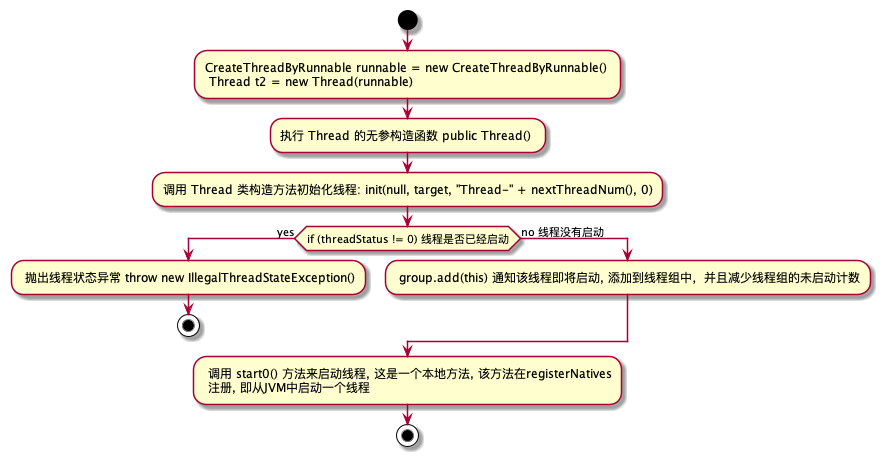

# Java 多线程

在早期的操作系统中并没有线程的概念，进程是能拥有资源和独立运行的最小单位，也是程序执行的最小单位。任务调度采用的是时间片轮转的抢占式调度方式，每个
进程有各自独立的一块内存，使得各个进程之间内存地址相互隔离。

后来随着计算机发展，对CPU的要求越来越高，进程之间的开销较大，已经无法满足越来越复杂的程序要求。于是有了线程的概念: 线程是程序执行中一个单一的顺序
控制流程，是程序执行流的最小单元，是处理器调度和分派的基本单位。一个进程可以有一个或多个线程，各个线程之间共享程序的内存空间

程序是指序列指令，这些指令可以让 CPU 按照人类指令完成相应的任务。在操作系统中启动一个 JVM 虚拟机

# Java 线程的创建

Java JDK 中包含了对多线程技术的支持。实现多线程编程主要有两种方式：

1. 继承 Thread 类；

2. 实现 Runnable 接口；

## 继承 Thread 类

继承 Thread 类实现线程：

```java
public class CreateThreadByExtendsThread extends Thread{
    @Override
    public void run() {
        super.run();
        System.out.println("Create Thread by Extends Thread Begin to Run!");
    }
}
```

测试类：

```java
public class ThreadTest {
    public static void main(String[] args) {
        CreateThreadByExtendsThread t = new CreateThreadByExtendsThread();
        t.setName("CreateThreadByExtendsThread"); // 指定线程执行名称
        t.start();  // 耗时较长
        System.out.println("当前线程" + Thread.currentThread().getName() + "执行结束\n" + "当前线程" + t.getName() + "执行结束"); //主线程耗时较短
    }
}
```

输出结果：

```test
当前线程main执行结束， 归属线程组为：java.lang.ThreadGroup[name=main,maxpri=10]
当前线程CreateThreadByExtendsThread执行结束, 归属线程组为: java.lang.ThreadGroup[name=main,maxpri=10]
Create Thread by Extends Thread Begin to Run!

Create Thread by Extends Thread Begin to Run!
当前线程main执行结束， 归属线程组为：java.lang.ThreadGroup[name=main,maxpri=10]
当前线程CreateThreadByExtendsThread执行结束, 归属线程组为: java.lang.ThreadGroup[name=main,maxpri=10]
```

多次执行的结果，仔细观察就会发现，输出结果并不是随着调用顺序而输出的，而是随机输出，可能 main 先输出打印信息，或者 `CreateThreadByExtendsThread` 先输出打印信息。

## 实现 Runnable 接口

如果想创建的线程类已经有了一个父类了，那么就不能再继承 Thread 类，此时就需要实现 Runnable 接口来解决这样的问题。

实现 Runnable 接口线程类

```java
public class CreateThreadByRunnable implements Runnable{

    @Override
    public void run() {
        System.out.println("Create Thread by implements Runnable Begin to Run!");
    }
}
```

测试类

```java
public class ThreadTest {
    public static void main(String[] args) {
        CreateThreadByRunnable runnable = new CreateThreadByRunnable();
        Thread t2 = new Thread(runnable);
        t2.setName("CreateThreadByRunnable");
        t2.start();  // 耗时较长
        System.out.println("当前线程" + Thread.currentThread().getName() + "执行结束\n" + "当前线程" + t2.getName() + "执行结束"); //主线程耗时较短
    }
}
```

## 为什么需要 Runnable 接口

使用继承 Thread 类的方式实现多线程在程序设计上是有局限性的，这是由 Java 本身不支持多继承导致的。为了解决这样的局限性，因此采用实现 Runnable 接口来实现多线程的开发。例如当一个类已经有一个父类，那么该类就不能再继承 Thread 了。


# 线程启动流程



在 Thread 类中有相应的无参构造和有参构造，都会调用 init() 方法完成线程属性的初始化。源码如下：

```
/**
 * Allocates a new {@code Thread} object. This constructor has the same
 * effect as {@linkplain #Thread(ThreadGroup,Runnable,String) Thread}
 * {@code (null, null, gname)}, where {@code gname} is a newly generated
 * name. Automatically generated names are of the form
 * {@code "Thread-"+}<i>n</i>, where <i>n</i> is an integer.
 */
 // 无参构造
public Thread() {
    init(null, null, "Thread-" + nextThreadNum(), 0);
}


/**
 * Allocates a new {@code Thread} object. This constructor has the same
 * effect as {@linkplain #Thread(ThreadGroup,Runnable,String) Thread}
 * {@code (null, target, gname)}, where {@code gname} is a newly generated
 * name. Automatically generated names are of the form
 * {@code "Thread-"+}<i>n</i>, where <i>n</i> is an integer.
 *
 * @param  target
 *         the object whose {@code run} method is invoked when this thread
 *         is started. If {@code null}, this classes {@code run} method does
 *         nothing.
 */
// 有参构造
public Thread(Runnable target) {
    init(null, target, "Thread-" + nextThreadNum(), 0);
}
```

## 线程编号

在 Thread 构造参数中会调用 nextThreadNum() 方法为线程编码：

源码如下：

```java
private static synchronized int nextThreadNum() {
    return threadInitNumber++;
}
```

## 线程属性初始化

Thread 所有的构造参数最终都会执行 init()  方法完成对线程属性的初始化。源码如下：

```java
/**
 * Initializes a Thread.
 *
 * @param g the Thread group
 * @param target the object whose run() method gets called
 * @param name the name of the new Thread
 * @param stackSize the desired stack size for the new thread, or
 *        zero to indicate that this parameter is to be ignored.
 * @param acc the AccessControlContext to inherit, or
 *            AccessController.getContext() if null
 * @param inheritThreadLocals if {@code true}, inherit initial values for
 *            inheritable thread-locals from the constructing thread
 */
private void init(ThreadGroup g, Runnable target, String name,
                  long stackSize, AccessControlContext acc,
                  boolean inheritThreadLocals) {
    // 可以看到如果线程名称 null， 会直接抛出异常
    if (name == null) {
        throw new NullPointerException("name cannot be null");
    }
    // 线程名称赋值
    this.name = name;
    // currentThread() 获取当前线程正在被那个线程调用
    Thread parent = currentThread();
    // 获取系统安全管理，没有返回 null 作用：防止启动Java 程序中，有恶意代码(删除系统文件、重启系统)，这个时候就需要启动 Java 安全
    // 管理器， 怎么使用可以看下这个： https://cloud.tencent.com/developer/article/1793295
    SecurityManager security = System.getSecurityManager();
    // 如果线程组没有显示传入 为 null
    if (g == null) {
        /* Determine if it's an applet or not */

        /* If there is a security manager, ask the security manager
           what to do. */
        // 如果开启了安全管理器，则当前线程组 g = 安全管理器的线程组
        if (security != null) {
            g = security.getThreadGroup();
        }

        /* If the security doesn't have a strong opinion of the matter
           use the parent thread group. */
        // 如果没有开启安全管器，则获取调用当前线程的线程组
        if (g == null) {
            g = parent.getThreadGroup();
        }
    }

    /* checkAccess regardless of whether or not threadgroup is
       explicitly passed in. */
    // 确定当前线程是否有权限修改线程组
    g.checkAccess();

    /*
     * Do we have the required permissions?
     */
     // 是否开启了安全管理器 参见 系统安全管理
    if (security != null) {
        if (isCCLOverridden(getClass())) {
            security.checkPermission(SUBCLASS_IMPLEMENTATION_PERMISSION);
        }
    }

    // 增加未启动线程的计数
    g.addUnstarted();
    // 线程组的赋值
    this.group = g;
    // 守护进程标示赋值默认false
    this.daemon = parent.isDaemon();
    // 线程优先级
    this.priority = parent.getPriority();
    if (security == null || isCCLOverridden(parent.getClass()))
        this.contextClassLoader = parent.getContextClassLoader();
    else
        this.contextClassLoader = parent.contextClassLoader;
    this.inheritedAccessControlContext =
            acc != null ? acc : AccessController.getContext();
    // 目标线程调用
    this.target = target;
    // 设置线程优先级
    setPriority(priority);
    if (inheritThreadLocals && parent.inheritableThreadLocals != null)
        this.inheritableThreadLocals =
            ThreadLocal.createInheritedMap(parent.inheritableThreadLocals);
    /* Stash the specified stack size in case the VM cares */
   // 线程栈大小
    this.stackSize = stackSize;

    /* Set thread ID */
    // 线程ID
    tid = nextThreadID();
}
```

线程属性初始化完成，下一步就是启动线程了。

## 线程启动 start

线程启动是通过调用 start() 方法启动的，线程从 NEW 状态转换为 RUNNABLE，然后由 JVM 调用该线程的 run 方法去执行该线程的逻辑。直接调用 run() 方法就是执行该类的 run() 方法逻辑，和调用该类的普通方法没什么区别。

具体看一下 start() 是如何启动线程的。源码如下：

```java
/**
 * Causes this thread to begin execution; the Java Virtual Machine
 * calls the <code>run</code> method of this thread.
 * <p>
 * The result is that two threads are running concurrently: the
 * current thread (which returns from the call to the
 * <code>start</code> method) and the other thread (which executes its
 * <code>run</code> method).
 * <p>
 * It is never legal to start a thread more than once.
 * In particular, a thread may not be restarted once it has completed
 * execution.
 *
 * @exception  IllegalThreadStateException  if the thread was already
 *               started.
 * @see        #run()
 * @see        #stop()
 */
public synchronized void start() {
    /**
     * This method is not invoked for the main method thread or "system"
     * group threads created/set up by the VM. Any new functionality added
     * to this method in the future may have to also be added to the VM.
     *
     * A zero status value corresponds to state "NEW".
     */
     // 判断线程状态是否已经启动，如果已经启动则抛出线程状态异常
    if (threadStatus != 0)
        throw new IllegalThreadStateException();

    /* Notify the group that this thread is about to be started
     * so that it can be added to the group's list of threads
     * and the group's unstarted count can be decremented. */
    // 将线程放入线程组中 ThreadGroup
    group.add(this);

    boolean started = false;
    try {
        // 调用本地方法启动线程
        start0();
        started = true;
    } finally {
        try {
            if (!started) {
                group.threadStartFailed(this);
            }
        } catch (Throwable ignore) {
            /* do nothing. If start0 threw a Throwable then
              it will be passed up the call stack */
        }
    }
}
```
将线程添加到线程组中 ThreadGroup。

### add(Thread t) 将线程添加到线程组中

源码如下：

```java
/**
 * Adds the specified thread to this thread group.
 *
 * <p> Note: This method is called from both library code
 * and the Virtual Machine. It is called from VM to add
 * certain system threads to the system thread group.
 *
 * @param  t
 *         the Thread to be added
 *
 * @throws  IllegalThreadStateException
 *          if the Thread group has been destroyed
 */
void add(Thread t) {
    synchronized (this) {
        // 前提是线程没销毁
        if (destroyed) {
            throw new IllegalThreadStateException();
        }
        // threads 数组什么时候初始化为大小为 4 的：JVM 在初始化的时候会向启动组中添加守护线程
        // 比较奇怪的是在 win 上可以看到 4 个， 在 Mac 上只能看到 3 个

       
        if (threads == null) {
            threads = new Thread[4];
        } else if (nthreads == threads.length) {
            threads = Arrays.copyOf(threads, nthreads * 2);
        }
        threads[nthreads] = t;

        // This is done last so it doesn't matter in case the
        // thread is killed
        // 因为启动线程数加 1 是最后完成的，即使线程被杀死也没关系
        nthreads++;

        // The thread is now a fully fledged member of the group, even
        // though it may, or may not, have been started yet. It will prevent
        // the group from being destroyed so the unstarted Threads count is
        // decremented.
        // 因为线程已经添加到线程组中，尽管线程状态不确定是否启动，但是该线程已经是线程中的正式成员，所以未启动线程减一
        nUnstartedThreads--;
    }
}
```

将线程添加到线程组中后，接着调用本地方法 start0() 启动线程。本地方法注册是由 Thread 类静态块中 registerNatives(); 完成本地方法的注册。到这里，Java 的线程启动已经完成了，其后的操作是非 Java 代码完成，最终完成线程的启动。涉及到非 Java 的代码，后面再补充。

### 启动失败

如果线程启动失败，调用线程组 threadStartFailed(Thread t) 方法 移除线程，并将未启动线程 +1。源码如下：

```
void threadStartFailed(Thread t) {
    synchronized(this) {
        remove(t);
        nUnstartedThreads++;
    }
}

/**
 * Removes the specified Thread from this group. Invoking this method
 * on a thread group that has been destroyed has no effect.
 *
 * @param  t
 *         the Thread to be removed
 */
private void remove(Thread t) {
    synchronized (this) {
        if (destroyed) {
            return;
        }
        for (int i = 0 ; i < nthreads ; i++) {
            if (threads[i] == t) {
                System.arraycopy(threads, i + 1, threads, i, --nthreads - i);
                // Zap dangling reference to the dead thread so that
                // the garbage collector will collect it.
                threads[nthreads] = null;
                break;
            }
        }
    }
}
```

# Thread 方法介绍

## currentThread() 方法

该方法可以返回代码段正在被那个线程调用。通过该方法可以验证一下使用 start 启动线程和直接调用 run 方法的不同.
测试类：

```java
public class CurrentThreadMethod extends Thread{

    public CurrentThreadMethod(){
        System.out.println("构造方法的打印，当前线程执行名称：: " + Thread.currentThread().getName());
    }

    @Override
    public void run() {
        System.out.println("run 方法打印, 当前线程执行名称：" + Thread.currentThread().getName());
    }
}


public class ThreadMethod {
    public static void main(String[] args) {
        CurrentThreadMethod currentThreadMethod = new CurrentThreadMethod();
        Thread t = new Thread(currentThreadMethod);
        t.start();
        t.run();

    }
}

// 输出结果

构造方法的打印，当前线程执行名称：: main
run 方法打印, 当前线程执行名称：main
run 方法打印, 当前线程执行名称：Thread-1
```

1. 观察输出结果能看到 直接调用 run 方法是由 main 调用的，并没有启动一个线程，使用 start 调用则是启动了一个新的线程；
2. 直接调用 run 方法是立即执行的， t.start() 则是需要等待 CPU 调度，然后执行。

### this.getName() 和 currentThread.getName()

currentThread.getName()方法: 返回当前代码段正在被那个线程调用；

this.getName()方法：获取当前对象的名字，只是单纯的方法调用；

```
public class CurrentThreadMethod extends Thread{

    public CurrentThreadMethod(){
        System.out.println("构造方法的打印，当前线程执行名称：: " + Thread.currentThread().getName());
        System.out.println("构造方法的打印，当前类的名称：" + this.getName());
    }

    @Override
    public void run() {
        System.out.println("run 方法打印, 当前线程执行名称：" + Thread.currentThread().getName());
        System.out.println("run 方法打印，当前类的名称" + this.getName());
    }
}

public class ThreadMethod {
    public static void main(String[] args) {
        CurrentThreadMethod currentThreadMethod = new CurrentThreadMethod();
        Thread t = new Thread(currentThreadMethod);
        t.setName("执行线程A");
        t.start();
        t.run();

    }
}

// 输出结果
构造方法的打印，当前线程执行名称：: main
构造方法的打印，当前类的名称：Thread-0
run 方法打印, 当前线程执行名称：main
run 方法打印，当前类的名称Thread-0
run 方法打印, 当前线程执行名称：执行线程A
run 方法打印，当前类的名称Thread-0
```
this.getName() 代表的是 CurrentThreadMethod 对象的名称, 只是单纯的方法调用，没有重写这个方法，所以调用的是父类 Thread 方法，初始化
CurrentThreadMethod 的 name 名称 Thread-0；

t.setName() 的 name 是 Thread 对象，并不会影响 CurrentThreadMethod 的 name 属性

## isAlive() 方法

isAlive() 方法的功能是判断当前的线程是否存活。
```
public class ThreadisAliveMethod extends Thread{
    @Override
    public void run() {
        System.out.println("run=" + Thread.currentThread().isAlive());
    }
}


ThreadisAliveMethod threadisAliveMethod = new ThreadisAliveMethod();
System.out.println("threadisAliveMethod 线程状态 start ：" + threadisAliveMethod.isAlive());
threadisAliveMethod.start();
System.out.println("threadisAliveMethod 线程状态 end：" + threadisAliveMethod.isAlive());

// 输出结果
threadisAliveMethod 线程状态 start ：false
threadisAliveMethod 线程状态 end：true
run=true
```

注意这里 end=true 是不确定的，因为在执行打印 end 的时候，线程可能未结束，因而 end=true。如果改将代码更改一下：
```
ThreadisAliveMethod threadisAliveMethod = new ThreadisAliveMethod();
System.out.println("threadisAliveMethod 线程状态 start ：" + threadisAliveMethod.isAlive());
threadisAliveMethod.start();
try {
    Thread.sleep(1000);
} catch (InterruptedException e) {
    //doNothing
}
System.out.println("threadisAliveMethod 线程状态 end：" + threadisAliveMethod.isAlive());

// 输出结果
threadisAliveMethod 线程状态 start ：false
run=true
threadisAliveMethod 线程状态 end：false
```

Thread.sleep(1000) 是让 main 线程停止 1 秒，过 1s 后 threadisAliveMethod 线程执行完成，此时该线程状态 end = true。

### this.isAlive() 和 currentThread.isAlive()

当将线程对象以构造参数的方式传递给 Thread 对象进行 start 启动时，运行的结果与前面是有差异的。示例如下：

```
public class ThreadisAliveMethod extends Thread{

    public ThreadisAliveMethod() {
        System.out.println("ThreadisAliveMethod-------------begin");
        System.out.println("Thread.currentThread.getName=" + Thread.currentThread().getName());
        System.out.println("currentThread.isAlive=" + Thread.currentThread().isAlive());
        System.out.println("this.getName()=" + this.getName());
        System.out.println("this.isAlive=" + this.isAlive());
        System.out.println("ThreadisAliveMethod-------------end");

    }

    @Override
    public void run() {
        System.out.println("run-------------begin");
        System.out.println("Thread.currentThread.getName=" + Thread.currentThread().getName());
        System.out.println("currentThread.isAlive=" + Thread.currentThread().isAlive());
        System.out.println("thi.getName()=" + this.getName());
        System.out.println("this.isAlive=" + this.isAlive());
        System.out.println("run-------------end");
    }
}

ThreadisAliveMethod aliveMethod = new ThreadisAliveMethod();
Thread t2 = new Thread(aliveMethod);
System.out.println("t2 线程状态 start ：" + t2.isAlive());
t2.setName("aliveThread");
t2.start();
System.out.println("t2 线程状态 end：" + t2.isAlive());


输出结果：
ThreadisAliveMethod-------------begin
Thread.currentThread.getName=main
currentThread.isAlive=true
thi.getName()=Thread-0
this.isAlive=false
ThreadisAliveMethod-------------end
t2 线程状态 start ：false
t2 线程状态 end：true
run-------------begin
Thread.currentThread.getName=aliveThread
currentThread.isAlive=true
thi.getName()=Thread-0
this.isAlive=false
run-------------end
```
当我们将线程对象以构造参数的形式传递给 Thread 对象进行 start 启动，使用 Thread.currentThread 和 this 代表的对象是不一样的。因为我们将线程
对象作为构造参数传递给 Thread 类，然后使用 Thread 方法 start 启动线程，然后执行的是传递的线程对象的 run 方法，所以 this.isAlive() 获取的是
没有被启动的线程对象信息，而使用Thread.currentThread() 获取的得则是调用这段代码的线程信息，即 Thread 信息。所以本次示例的结果才与前面的示例结果
有差异。

## sleep(long millis) 方法
sleep 方法的作用是在指定时间(毫秒)内让当前正在执行的线程休眠(暂停执行), 这个正在执行的线程是指 this.currentThread() 返回的线程。

```
public class ThreadSleepMethod extends Thread{
    @Override
    public void run() {
        System.out.println("run threadName = " + this.currentThread().getName() + "begin");
        try {
            this.sleep(2000);
            System.out.println("run threadName = "+ currentThread().getName() + "end");
        } catch (InterruptedException e) {
            // doNothing
        }
    }
}

// 直接调用 run方法
ThreadSleepMethod threadSleepMethod = new ThreadSleepMethod();
System.out.println("begin----------------" + System.currentTimeMillis());
threadSleepMethod.run();
System.out.println("end------------------" + System.currentTimeMillis());
```

当调用 sleep() 方法所在类是 Thread 时，则执行代码 this.sleep() 和 Thread.sleep() 效果是一样的，当调用 sleep() 方法不在 Thread 类中，
必须使用 Thread.sleep() 方法。 以第一种为例：
：
```
// this.sleep() 结果
begin----------------1647745747085
run threadName = mainbegin
run threadName = mainend
end------------------1647745749090花费时间为=2s
// Thread.sleep()
begin----------------1647745810897
run threadName = mainbegin
run threadName = mainend
end------------------1647745812901花费时间为=2s
```
启动线程测试：
```
long start2 = System.currentTimeMillis();
ThreadSleepMethod sleepMethod = new ThreadSleepMethod();
System.out.println("begin----------------" + start2);
sleepMethod.start();
System.out.println("end------------------" + System.currentTimeMillis() + "花费时间为=" +(System.currentTimeMillis() - start2)/1000 + "s");

// 输出结果：
begin----------------1647745985861
end------------------1647745985862花费时间为=0s
run threadName = Thread-0begin
run threadName = Thread-0end
```
由于 main 线程与 sleepMethod 异步，sleepMethod 暂停 2s 执行，所以首先输出 main 线程打印的信息，2s 后输出 sleepMethod 信息

### sleep(long millis, int nanos) 方法

该方法的作用是在指定的毫秒数加指定的纳秒数内让当前正在执行的线程休眠，此操作系统受到系统计时器和调度程序的精准度和准确性的影响。

```
// sleep(long millis, int nanos)
long start3 = System.currentTimeMillis();
System.out.println("begin----------------" + start3);
try {
    Thread.sleep(2000, 999999);
} catch (InterruptedException e) {
    e.printStackTrace();
}
System.out.println("end------------------" + System.currentTimeMillis() + "花费时间为=" +(System.currentTimeMillis() - start3) + "ms");

// 输出结果：
begin----------------1647748698686
end------------------1647748700690花费时间为=2004ms
```
可以看到 ns 级线程的休眠时间并不是那么准确了。

## getStackTrace() 方法

该方法的作用是返回一个表示该该线程堆栈跟踪元素数组。如果线程尚未启动或者已经终止，则该方法将返回一个 0 长度数组。否则数组中第一个元素代表
堆栈顶，它是该数组中最新的方法调用；最后一个元素代表堆栈底，是该数组中最开始的方法调用。测试代码如下：

```
public class GetStackTraceThreadMethod extends Thread{

    private void a(){
        b();
    }

    private void b(){
        c();
    }

    private void c(){
        d();
    }

    private void d(){
        e();
    }

    private void e(){
        StackTraceElement[]  elementArray = Thread.currentThread().getStackTrace();
        if(elementArray != null){
            for (StackTraceElement element : elementArray) {
                System.out.println("className= " + element.getClassName() + "\nmethodName= " + element.getMethodName() +
                        "\nfileName= " + element.getFileName() + "\nlineNumber= " + element.getLineNumber());
            }
        }else{
            System.out.println("线程没有启动");
        }

        StackTraceElement[]  elementArray2 = this.getStackTrace();
        System.out.println("当前线程类 GetStackTraceThreadMethod 大小为= " + elementArray2.length);
        if(elementArray2 != null){
            for (StackTraceElement element : elementArray2) {
                System.out.println("className= " + element.getClassName() + "\nmethodName= " + element.getMethodName() +
                        "\nfileName= " + element.getFileName() + "\nlineNumber= " + element.getLineNumber());
            }
        }else{
            System.out.println("线程没有启动");
        }
    }

    @Override
    public void run() {
        System.out.println("run---------------------------start");
        a();
        System.out.println("run---------------------------end");
    }
}

public class GetStackTraceThreadMethodTest {
    
    public static void main(String[] args) {
//        // 直接启动线程
//        GetStackTraceThreadMethod stackTraceThreadMethod = new GetStackTraceThreadMethod();
//        stackTraceThreadMethod.setName("getStackTrace");
//        stackTraceThreadMethod.start();

        // 作为构造参数传入
        GetStackTraceThreadMethod stackTraceThreadMethod1 = new GetStackTraceThreadMethod();
        Thread t= new Thread(stackTraceThreadMethod1);
        t.setName("getStackTrace2");
        t.start();
    }
}

输出结果：
run---------------------------start
className= java.lang.Thread
methodName= getStackTrace
fileName= Thread.java
lineNumber= 1559
className= com.anzhi.threadmethod.getstacktrace.GetStackTraceThreadMethod
methodName= e
fileName= GetStackTraceThreadMethod.java
lineNumber= 23
className= com.anzhi.threadmethod.getstacktrace.GetStackTraceThreadMethod
methodName= d
fileName= GetStackTraceThreadMethod.java
lineNumber= 19
className= com.anzhi.threadmethod.getstacktrace.GetStackTraceThreadMethod
methodName= c
fileName= GetStackTraceThreadMethod.java
lineNumber= 15
className= com.anzhi.threadmethod.getstacktrace.GetStackTraceThreadMethod
methodName= b
fileName= GetStackTraceThreadMethod.java
lineNumber= 11
className= com.anzhi.threadmethod.getstacktrace.GetStackTraceThreadMethod
methodName= a
fileName= GetStackTraceThreadMethod.java
lineNumber= 7
className= com.anzhi.threadmethod.getstacktrace.GetStackTraceThreadMethod
methodName= run
fileName= GetStackTraceThreadMethod.java
lineNumber= 48
className= java.lang.Thread
methodName= run
fileName= Thread.java
lineNumber= 748
当前线程类 GetStackTraceThreadMethod 大小为= 0
run---------------------------end
```
## dumpStack() 方法

该方法的作用是将当前线程的堆栈跟踪信息输出至标准错误流，该方法仅适用于调试。

```
public class DumpStackThreadMethod extends Thread{

    private void a(){
        b();
    }

    private void b() {
        c();
    }

    private void c() {
        d();
    }

    private void d() {
        e();
    }
    private void e(){
        int age = 100;
        if(age == 100){
            Thread.dumpStack();
        }
    }

    @Override
    public void run() {
        e();
    }
}

public class DumpStackThreadMethodTest {
    public static void main(String[] args) {
        DumpStackThreadMethod dumpStackThreadMethod = new DumpStackThreadMethod();
        dumpStackThreadMethod.start();
    }
}

// 输出结果
java.lang.Exception: Stack trace
	at java.lang.Thread.dumpStack(Thread.java:1336)
	at com.anzhi.threadmethod.dumpStack.DumpStackThreadMethod.e(DumpStackThreadMethod.java:23)
	at com.anzhi.threadmethod.dumpStack.DumpStackThreadMethod.run(DumpStackThreadMethod.java:29)

```

## getAllStackTraces() 方法

该方法的作用是返回所有活动线程的堆栈跟踪的一个映射。key是线程， value是StackTraceElement[] 数组，该数组表示相应 Thread 的堆栈转储，返回的堆栈格式
都是针对 getStackTrace() 方法指定。

```
public class GetAllStackTracesMethod extends Thread{
    private void a(){
        b();
    }

    private void b() {
        c();
    }

    private void c() {
        d();
    }

    private void d() {
        e();
    }

    private void e() {
        Map<Thread,StackTraceElement[]> map = Thread.currentThread().getAllStackTraces();
        if(map != null && map.size() != 0){
            Iterator keyIterator = map.keySet().iterator();
            while(keyIterator.hasNext()){
                Thread eachThread = (Thread) keyIterator.next();
                StackTraceElement[] array = map.get(eachThread);
                System.out.println("-----------------每个线程的基本信息");
                System.out.println("线程名称：" + eachThread.getName());
                System.out.println("StackTraceElement[].length= " + array.length);
                System.out.println("线程的状态：" + eachThread.getState());

                if(array.length != 0){
                    System.out.println("输出 StackTraceElement[] 数组具体信息：");
                    for (StackTraceElement element : array) {
                        System.out.println("className= " + element.getClassName() + "  fileName=" +
                                element.getFileName() + "   lineNumber= " + element.getLineNumber());
                    }
                }else{
                    System.out.println("没有StackTraceElement[] 信息，因为线程：" + eachThread.getName()
                            + "中的StackTraceElement[].length=0");
                }
            }
        }
    }

    @Override
    public void run() {
        a();
    }
}


public class GetAllStackTracesMethodTest {
    public static void main(String[] args) {
        GetAllStackTracesMethod stackTracesMethod = new GetAllStackTracesMethod();
        stackTracesMethod.setName("GetAllStackTracesMethodTest");
        stackTracesMethod.start();
    }
}

// 输出结果
-----------------每个线程的基本信息
线程名称：DestroyJavaVM
StackTraceElement[].length= 0
线程的状态：RUNNABLE
没有StackTraceElement[] 信息，因为线程：DestroyJavaVM中的StackTraceElement[].length=0
-----------------每个线程的基本信息
线程名称：Finalizer
StackTraceElement[].length= 4
线程的状态：WAITING
输出 StackTraceElement[] 数组具体信息：
className= java.lang.Object  fileName=Object.java   lineNumber= -2
className= java.lang.ref.ReferenceQueue  fileName=ReferenceQueue.java   lineNumber= 144
className= java.lang.ref.ReferenceQueue  fileName=ReferenceQueue.java   lineNumber= 165
className= java.lang.ref.Finalizer$FinalizerThread  fileName=Finalizer.java   lineNumber= 216
-----------------每个线程的基本信息
线程名称：Attach Listener
StackTraceElement[].length= 0
线程的状态：RUNNABLE
没有StackTraceElement[] 信息，因为线程：Attach Listener中的StackTraceElement[].length=0
-----------------每个线程的基本信息
线程名称：Monitor Ctrl-Break
StackTraceElement[].length= 25
线程的状态：RUNNABLE
输出 StackTraceElement[] 数组具体信息：
className= java.util.Properties$LineReader  fileName=Properties.java   lineNumber= 478
className= java.util.Properties  fileName=Properties.java   lineNumber= 353
className= java.util.Properties  fileName=Properties.java   lineNumber= 341
className= sun.net.NetProperties  fileName=NetProperties.java   lineNumber= 70
className= sun.net.NetProperties  fileName=NetProperties.java   lineNumber= 41
className= sun.net.NetProperties$1  fileName=NetProperties.java   lineNumber= 47
className= sun.net.NetProperties$1  fileName=NetProperties.java   lineNumber= 45
className= java.security.AccessController  fileName=AccessController.java   lineNumber= -2
className= sun.net.NetProperties  fileName=NetProperties.java   lineNumber= 44
className= sun.net.spi.DefaultProxySelector$1  fileName=DefaultProxySelector.java   lineNumber= 95
className= sun.net.spi.DefaultProxySelector$1  fileName=DefaultProxySelector.java   lineNumber= 93
className= java.security.AccessController  fileName=AccessController.java   lineNumber= -2
className= sun.net.spi.DefaultProxySelector  fileName=DefaultProxySelector.java   lineNumber= 92
className= java.lang.Class  fileName=Class.java   lineNumber= -2
className= java.lang.Class  fileName=Class.java   lineNumber= 264
className= java.net.ProxySelector  fileName=ProxySelector.java   lineNumber= 72
className= java.net.SocksSocketImpl$3  fileName=SocksSocketImpl.java   lineNumber= 358
className= java.net.SocksSocketImpl$3  fileName=SocksSocketImpl.java   lineNumber= 356
className= java.security.AccessController  fileName=AccessController.java   lineNumber= -2
className= java.net.SocksSocketImpl  fileName=SocksSocketImpl.java   lineNumber= 355
className= java.net.Socket  fileName=Socket.java   lineNumber= 606
className= java.net.Socket  fileName=Socket.java   lineNumber= 555
className= java.net.Socket  fileName=Socket.java   lineNumber= 451
className= java.net.Socket  fileName=Socket.java   lineNumber= 228
className= com.intellij.rt.execution.application.AppMainV2$1  fileName=AppMainV2.java   lineNumber= 42
-----------------每个线程的基本信息
线程名称：GetAllStackTracesMethodTest
StackTraceElement[].length= 8
线程的状态：RUNNABLE
输出 StackTraceElement[] 数组具体信息：
className= java.lang.Thread  fileName=Thread.java   lineNumber= -2
className= java.lang.Thread  fileName=Thread.java   lineNumber= 1610
className= com.anzhi.threadmethod.getallstacktraces.GetAllStackTracesMethod  fileName=GetAllStackTracesMethod.java   lineNumber= 24
className= com.anzhi.threadmethod.getallstacktraces.GetAllStackTracesMethod  fileName=GetAllStackTracesMethod.java   lineNumber= 20
className= com.anzhi.threadmethod.getallstacktraces.GetAllStackTracesMethod  fileName=GetAllStackTracesMethod.java   lineNumber= 16
className= com.anzhi.threadmethod.getallstacktraces.GetAllStackTracesMethod  fileName=GetAllStackTracesMethod.java   lineNumber= 12
className= com.anzhi.threadmethod.getallstacktraces.GetAllStackTracesMethod  fileName=GetAllStackTracesMethod.java   lineNumber= 8
className= com.anzhi.threadmethod.getallstacktraces.GetAllStackTracesMethod  fileName=GetAllStackTracesMethod.java   lineNumber= 51
-----------------每个线程的基本信息
线程名称：Reference Handler
StackTraceElement[].length= 4
线程的状态：WAITING
输出 StackTraceElement[] 数组具体信息：
className= java.lang.Object  fileName=Object.java   lineNumber= -2
className= java.lang.Object  fileName=Object.java   lineNumber= 502
className= java.lang.ref.Reference  fileName=Reference.java   lineNumber= 191
className= java.lang.ref.Reference$ReferenceHandler  fileName=Reference.java   lineNumber= 153
-----------------每个线程的基本信息
线程名称：Signal Dispatcher
StackTraceElement[].length= 0
线程的状态：RUNNABLE
没有StackTraceElement[] 信息，因为线程：Signal Dispatcher中的StackTraceElement[].length=0
```
根据结果可以看到虚拟机启动的一些线程以及我们自己创建的线程，虚拟机启动的线程的具体作用还没有了解，记一下 ToDo。

## getId() 方法

getId() 方法用于取得线程的唯一标识。

```
public class GetIdThreadMethod extends Thread{
    @Override
    public void run() {
        System.out.println("----------------------begin");
        System.out.println("runThreadName.getNamew=" + Thread.currentThread().getName() + "  runThreadId= "
                + Thread.currentThread().getId() + "  runThreadState= " + Thread.currentThread().getState());
    }
}

public class GetIdThreadMethodTest {
    public static void main(String[] args) {
        GetIdThreadMethod idThreadMethod = new GetIdThreadMethod();
        idThreadMethod.start();
    }
}

// 输出信息
runThreadName.getNamew=Thread-0  runThreadId= 12  runThreadState= RUNNABLE
```

## yield() 方法

该方法的作用是放弃当前的 CPU 资源，让其他任务去占用 CPU 执行时间。但是放弃的时间不确定，有可能刚刚放弃，马上又获得 CPU 时间片。
测试用例如下：

```
public class YieldThreadMethod extends Thread{
    @Override
    public void run() {
        long beginTime = System.currentTimeMillis();
        int count = 0;
        for(int i=0; i<50000000; i++){
            Thread.yield();
            count = count + (i+1);
        }

        long endTime = System.currentTimeMillis();
        System.out.println("用时： " + (endTime - beginTime) + "毫秒!");
    }
}

public class YieldThreadMethodTest {
    public static void main(String[] args) {
        YieldThreadMethod th = new YieldThreadMethod();
        th.start();
    }
}

// 输出结果：
用时： 16445毫秒!
// 注释掉 Thread.yield();再运行
用时： 47毫秒!
```

# 停止线程

Java 中有以下几种方式可以使正在运行的线程终止运行。

1. 使用退出标志使线程正常退出；
2. 使用 stop() 方法强行终止线程，但是这种方法不推荐使用，使用 stop() 和 suspend()、resume() 一样，
   都是作废过期的方法，使用这些方法可能发生不可预料的结果；
3. 使用 interrupt() 中断线程；

## 无法停止的线程

下面示例使用 interrupt() 方法来停止线程，但是 interrupt() 方法的效果并不像 for+break那样立即终止循环。 调用 interrupt() 方法仅仅是在当前
线程中做了一个停止的标志位，并不是真正地停止线程。

```
public class InterruptThreadMethod extends Thread{
    @Override
    public void run() {
        for(int i=0; i<10; i++){
            System.out.println("i=" + (i+1));
        }
    }
}

public class InterruptThreadMethodTest {
    public static void main(String[] args) {
        InterruptThreadMethod interruptThreadMethod = new InterruptThreadMethod();
        interruptThreadMethod.start();
        try {
            Thread.sleep(2000);
        } catch (InterruptedException e) {
            // doNothing
        }
        interruptThreadMethod.interrupt();
        System.out.println("InterruptThreadMethod test");
    }
}

// 输出结果
i=1
i=2
i=3
i=4
i=5
i=6
i=7
i=8
i=9
i=10
InterruptThreadMethod test
```
根据结果可以看到即使调用了 interrupt() 方法，线程仍然在运行，并没有停止。那么怎么停止线程呢？在了解如何停止线程之前，先了解一下如何判断线程的状态
已经是停止的。在 Java 的 SDK 中提供了两个判断方法：

1. public static boolean interrupted(): 判断 currentThread() 是否已经中断；
2. public boolean this.isInterrupted(): 测试 this 关键字所在类的对象是否已经中断

### interrupted() 方法
测试用例如下：

```
public class InterruptThreadMethodTest {
    public static void main(String[] args) {
        InterruptThreadMethod interruptThreadMethod = new InterruptThreadMethod();
        interruptThreadMethod.start();
        try {
            Thread.sleep(2000);
        } catch (InterruptedException e) {
            // doNothing
        }
        interruptThreadMethod.interrupt();
        System.out.println("是否停止1？ = " + interruptThreadMethod.interrupted());
        System.out.println("是否停止2？ = " + interruptThreadMethod.interrupted());
        System.out.println("InterruptThreadMethod test");
    }
}

public class InterruptThreadMethod extends Thread{
    @Override
    public void run() {
        for(int i=0; i<10; i++){
            System.out.println("i=" + (i+1));
        }
    }
}
// 输出结果
i=1
i=2
i=3
i=4
GetIdThreadMethod 是否被中断= true
是否停止1？ = false
是否停止2？ = false
InterruptThreadMethod test
```

根据结果证明了 interrupted() 方法的解释：测试当前线程是否已经中断，这个 “当前线程” 是 main，从未中断过，所以输出两个 false, 而线程类
GetIdThreadMethod 调用了中断方法，因而 interrupted() 输出结果为true, 而且 interrupted() 方式由 static 修饰的。

我们直接中断当前线程，

Thread.currentThread().interrupt();

发现输出结果发生了改变：

```
i=1
i=2
i=3
i=4
GetIdThreadMethod 是否被中断= true
是否停止1？ = true
是否停止2？ = false
InterruptThreadMethod test
```
这是因为 interrupted() 具有清除标识的功能，第一次调用时捕捉到了中断标记，在第二次调用时清除了该标记位。

### isInteruppted() 方法

从该方法的声明中可以知道，这个方法不是 static 修饰，只作用于这个对象。

```
Thread.currentThread().interrupt();
System.out.println("是否停止1？ = " + Thread.currentThread().isInterrupted());
System.out.println("是否停止2？ = " + Thread.currentThread().isInterrupted());
System.out.println("InterruptThreadMethod test");

// 输出结果
i=1
i=2
i=3
i=4
GetIdThreadMethod 是否被中断= true
是否停止1？ = true
是否停止2？ = true
InterruptThreadMethod test
```
根据结果可以看到 isInterrupted() 方法不具有执行后清除状态位的功能，因而输出两个 true。

## 停止线程的方法

### 异常法

根据前面的实践，我们可以根据线程的中断标识位来终止线程。修改上述代码

```
public class InterruptThreadMethod extends Thread{
    @Override
    public void run() {
        for(int i=0; i<4; i++){
            System.out.println("i=" + (i+1));
            if(this.isInterrupted()){
                System.out.println("线程已经是停止状态! 线程退出循环");
                break;
            }
        }
        System.out.println("GetIdThreadMethod 是否被中断1= " + this.interrupted());
        System.out.println("GetIdThreadMethod 是否被中断2= " + this.interrupted());
    }
}

public class InterruptThreadMethodTest {
    public static void main(String[] args) {
        InterruptThreadMethod interruptThreadMethod = new InterruptThreadMethod();
        interruptThreadMethod.start();
        interruptThreadMethod.interrupt();
        try {
            Thread.sleep(2000);
        } catch (InterruptedException e) {
            // doNothing
        }

        Thread.currentThread().interrupt();
        System.out.println("是否停止1？ = " + Thread.currentThread().isInterrupted());
        System.out.println("是否停止2？ = " + Thread.currentThread().isInterrupted());
        System.out.println("InterruptThreadMethod test");
    }
}

// 输出结果
i=1
线程已经是停止状态! 线程退出循环
GetIdThreadMethod 是否被中断1= true
GetIdThreadMethod 是否被中断2= false
是否停止1？ = true
是否停止2？ = true
InterruptThreadMethod test
```
根据结果发现即使停止了线程，但是还是会执行 for 循环之外的语句。线程并没有真正的终止。修改代码如下：

```
public class InterruptThreadMethod extends Thread{
    @Override
    public void run() {
        try {
            for (int i = 0; i < 4; i++) {
                System.out.println("i=" + (i + 1));
                if (this.isInterrupted()) {
                    System.out.println("线程已经是停止状态! 线程退出循环");
                    throw new InterruptedException();
                }
            }
            System.out.println("GetIdThreadMethod 是否被中断1= " + this.interrupted());
            System.out.println("GetIdThreadMethod 是否被中断2= " + this.interrupted());
        }catch(InterruptedException e){
            System.out.println("进入 InterruptThreadMethod 类中的 run 方法 catch 异常");
        }
    }
}

输出结果：
i=1
线程已经是停止状态! 线程退出循环
进入 InterruptThreadMethod 类中的 run 方法 catch 异常
是否停止1？ = true
是否停止2？ = true
InterruptThreadMethod test
```
当线程标识位为 true 的时候，抛出中断异常，通过异常结束线程。

### 在 sleep 状态下停止线程，会出现异常

在 sleep 状态下停止线程，会是什么效果呢？测试代码如下：

```
public class SleepInterruptedMethod extends Thread{
    @Override
    public void run() {
        try{
            System.out.println("run begin");
            Thread.sleep(2000);
            System.out.println("run end");
        }catch (InterruptedException e){
            System.out.println("在沉睡中被停止：进入 catch!" + this.isInterrupted());
            e.printStackTrace();
        }
    }
}

public class SleepInterruptedMethodTest {
    public static void main(String[] args) {
        SleepInterruptedMethod sleepThread = new SleepInterruptedMethod();
        sleepThread.start();
        try {
            Thread.sleep(200);
            sleepThread.interrupt();
        } catch (InterruptedException e) {
            e.printStackTrace();
        }
        System.out.println("end");
    }
}

// 输出结果：
run begin
end
在沉睡中被停止：进入 catch!false
java.lang.InterruptedException: sleep interrupted
	at java.lang.Thread.sleep(Native Method)
	at com.anzhi.threadmethod.interrupmethod.SleepInterruptedMethod.run(SleepInterruptedMethod.java:8)
```
根据打印结果可知：线程在 sleep 状态下停止，会导致 sleep 方法直接抛出异常，并清楚停止状态值，变为 false。

反过来：先中断，在 sleep同样会抛出异常

```
public class SleepInterruptedMethodTest {
    public static void main(String[] args) {
        SleepInterruptedMethod sleepThread = new SleepInterruptedMethod();
        sleepThread.start();
        //Thread.sleep(200);
        sleepThread.interrupt();
        System.out.println("end");
    }
}
```

所以不管其调用的顺序，只要 interrupt 和 sleep 方法一起使用就会出现异常。

### 使用 stop() 方法暴力停止线程

使用 stop() 方法暴力停止线程, 测试代码如下：

```
public class StopThreadMethod extends Thread{
    int i=0;
    @Override
    public void run() {
        try{
            while (true){
                i++;
                System.out.println("i = " + i);
                Thread.sleep(1000);
            }
        }catch (InterruptedException e){
            // doNothing
        }
    }
}


public class StopThreadMethodTest {
    public static void main(String[] args) {
        try {
            StopThreadMethod stopThread = new StopThreadMethod();
            stopThread.start();
            Thread.sleep(8000);
            stopThread.stop();
        }catch (InterruptedException e){

        }
    }
}

// 输出结果
// 第一次
i = 1
i = 2
i = 3
i = 4
i = 5
i = 6
i = 7
i = 8
```

根据结果可以看出，线程被暴力退出。但是 stop() 方法是一个被删除的状态，因为 stop 容易造成业务处理的不确定性，因为线程不确定执行业务逻辑在哪里被停止
了。可能导致一些资源未释放或者一些数据缺失。

#### stop() 方法与 java.lang.ThreadDeath 异常

调用 stop() 方法时会抛出 java.lang.ThreadDeath 异常，但是在通常情况下，该异常不需要被显示地捕捉。

```
public class StopThreadMethod2 extends Thread{
    int i=0;
    @Override
    public void run() {
        try{
            this.stop();
        }catch (ThreadDeath e){
            // doNothing
            System.out.println("捕获 ThreadDeath 异常");
        }
    }
}


StopThreadMethod2 stopThreadMethod2 = new StopThreadMethod2();
stopThreadMethod2.start();

// 输出结果
捕获 ThreadDeath 异常
```
#### 使用 stop() 释放锁给数据造成不一致的结果

使用 stop() 释放锁会给数据造成不一致的结果，如果出现这样的情况，则程序处理的数据完全有可能遭到破坏，最终导致程序执行的流程是错误的。下面代码验证一下：

```
// 业务代码
public class StopReleaseLockService {
    private String username = "a";
    private String password = "aa";

    synchronized public String getUsername(){
        return username;
    }

    synchronized public String getPassword(){
        return password;
    }

    synchronized public void printString(String username, String password){
        try{
            this.username = username;
            Thread.sleep(100000000);
            this.password = password;
        }catch (InterruptedException e){

        }
    }
}

// 线程 A 调用 pringString  为用户名和密码赋值
public class StopReleaseLockThreadA extends Thread{

    private StopReleaseLockService serviceThread;

    public StopReleaseLockThreadA(StopReleaseLockService serviceThread) {
        this.serviceThread = serviceThread;
    }

    @Override
    public void run() {
        serviceThread.printString("b", "bb");
    }
}

// 线程 ThreadB 打印用户名和密码
public class StopReleaseLockThreadB extends Thread{

    private StopReleaseLockService serviceThread;

    public StopReleaseLockThreadB(StopReleaseLockService serviceThread) {
        this.serviceThread = serviceThread;
    }

    @Override
    public void run() {
        System.out.println("username=" + serviceThread.getUsername());
        System.out.println("password=" + serviceThread.getPassword());
    }
}

// 测试
public class StopReleaseLockThreadTest {
    public static void main(String[] args) {
        try {
            StopReleaseLockService stopReleaseLockService = new StopReleaseLockService();
            StopReleaseLockThreadA threadA = new StopReleaseLockThreadA(stopReleaseLockService);
            threadA.start();  // username = "b"，
            Thread.sleep(100);  // sleep 并不释放锁， 此时 password = "aa", 因为 threadA 也调用了 sleep(100000)
            StopReleaseLockThreadB stopReleaseLockThreadB = new StopReleaseLockThreadB(stopReleaseLockService);
            StopReleaseLockThreadB threadB = new StopReleaseLockThreadB(stopReleaseLockService);
            threadB.start();
            Thread.sleep(300);
            threadA.stop();  // 线程 ThreadA 强行停止，但是 password 仍然为 aa 释放锁，线程 threadB 执行，打印 username，password，
            System.out.println("stop 执行后， 在下方开始打印 username 和 password");
        } catch (InterruptedException e) {
            e.printStackTrace();
        }
    }
}

// 输出结果
stop 执行后， 在下方开始打印 username 和 password
username=b
password=aa
```
### 使用 return 语句停止线程的缺点与解决方案

将 interrupt() 方法与 return 语句结合使用也能实现停止线程的效果。代码如下：

```
public class ReturnStopThreadWithInterrupt extends Thread{
    @Override
    public void run() {
        while(true){
            if(Thread.interrupted()){
                System.out.println("ReturnStopThreadWithInterrupt 线程停止了");
                return ;
            }
            System.out.println("timer= " + System.currentTimeMillis());
        }
    }
}

public class ReturnStopThreadWithInterruptTest {
    public static void main(String[] args) {
        ReturnStopThreadWithInterrupt t = new ReturnStopThreadWithInterrupt();
        t.start();
        try {
            Thread.sleep(1000);
        } catch (InterruptedException e) {
            //
        }
        t.interrupt();
    }
}

// 输出结果
timer= 1647913348141
ReturnStopThreadWithInterrupt 线程停止了
```

虽然使用 “return” 较 “抛异常” 法在代码结构上可以更加方便地实现线程的停止，但是还是建议使用 “抛异常” 法，因为在 catch 块中可以对异常的信息进行统一
的处理。测试用例：

```
// return 方法
public class InterruptStopThreadMethod extends Thread{
    @Override
    public void run() {
        // insert 操作
        if(Thread.interrupted()){
            System.out.println("写入 log info");
            return ;
        }
        // updates 操作
        if(Thread.interrupted()){
            System.out.println("写入 log info");
        }
    }
}

// 异常法
public class InterruptStopThread extends Thread{
    @Override
    public void run() {
        try {
            // insert 操作
            if (Thread.interrupted()) {
                throw new InterruptedException();
            }
            // updates 操作
            if (Thread.interrupted()) {
                throw new InterruptedException();
            }
        }catch (InterruptedException e){
            System.out.println("写入 log info");
        }
    }
}
```

两段代码比较，写入日志的功能在 catch 中被统一处理了，避免代码的冗余。

# 暂停线程

暂停线程意味着此线程还可以恢复运行，在 Java 多线程中，可以使用 suspend() 方法暂停线程，使用resume() 方法来恢复线程执行。测试用例：

```
public class SuspendThreadMethod extends Thread{
    private long i = 0;

    public long getI() {
        return i;
    }

    public void setI(long i) {
        this.i = i;
    }

    @Override
    public void run() {
        while (true){
            i++;
        }
    }
}

public class SuspendThreadMethodTest {
    public static void main(String[] args) {
        try {
            SuspendThreadMethod th = new SuspendThreadMethod();
            th.setName("A");
            th.start();
            Thread.sleep(5000);

            // A 暂停
            th.suspend();
            System.out.println("A= " + System.currentTimeMillis() + " i= " + th.getI());
            Thread.sleep(5000);
            System.out.println("A= " + System.currentTimeMillis() + " i= " + th.getI());

            // B 段
            th.resume();
            Thread.sleep(5000);

            // C 段
            th.suspend();
            System.out.println("B= " + System.currentTimeMillis() + " i= " + th.getI());
            Thread.sleep(5000);
            System.out.println("B= " + System.currentTimeMillis() + " i= " + th.getI());
        }catch (InterruptedException e){

        }
    }
}

// 输出结果
A= 1647920256695 i= 3359912554
A= 1647920261705 i= 3359912554
B= 1647920266711 i= 6800392340
B= 1647920271718 i= 6800392340
```

可以看到 C 段没有输出，线程确实被暂停了，并且也可以被恢复运行。

### suspend() 方法与 resume() 方法的缺点-独占
当挂起线程时，我们无法知道线程正在执行什么代码。 如果在安全权限评估期间挂起一个线程而它持有锁，则程序中的其他线程可能会被阻止。
如果在执行类构造函数时挂起线程，则 AppDomain 中尝试使用该类的其他线程将被阻止。 死锁很容易发生

```
public class SuspendThreadObject {
    synchronized public void printString(){
        System.out.println("begin");
        if(Thread.currentThread().getName().equals("a")){
            System.out.println("a 线程永远 suspend!");
            Thread.currentThread().suspend();
        }
        System.out.println("end");
    }
}

public class SuspendThreadObjectTest {
    public static void main(String[] args) {
        try{
            final SuspendThreadObject object = new SuspendThreadObject();

            Thread thread = new Thread() {
                @Override
                public void run() {
                    object.printString();
                }
            };

            thread.setName("a");
            thread.start();

            Thread.sleep(1000);

            Thread thread2 = new Thread() {
                @Override
                public void run() {
                    System.out.println("thread2 启动了，但是无法进入 printString() 方法，只打印个begin");
                    System.out.println("因为printString()方法被a线程锁定并且永远被 suspend 暂停了");
                    object.printString();
                }
            };
            thread2.setName("b");
            thread2.start();
        }catch (InterruptedException e){
            // doNothing
        }
    }
}

// 输出结果
begin
a 线程永远 suspend!
thread2 启动了，但是无法进入 printString() 方法，只打印个begin
因为printString()方法被a线程锁定并且永远被 suspend 暂停了
```

根据结果分析，a 线程永远暂停，持有锁不释放，导致 线程 b 一直在等待形成死锁如图：


### 另外一种独占情况

```
public class MainDestory extends Thread{
    private long i=0;

    @Override
    public void run() {
        while(true){
            i++;
        }
    }
}


public class MainDestoryTest {
    public static void main(String[] args) {
        try{
            MainDestory th = new MainDestory();
            Thread.sleep(1000);
            th.start();
            th.suspend();
            System.out.println("main end");
        }catch (InterruptedException e){
            // doNothing
        }
    }
}

// 输出结果：
main end
```
虽然主线程 main 结束了，但是 MainDestory 是暂停状态，线程并不会销毁。

修改上述代码，另一种死锁：

```
public class MainDestoryAnotherDeadLock extends Thread{
    private long i=0;

    @Override
    public void run() {
        while(true){
            i++;
            System.out.println(i);
        }
    }
}
```
PrintStream 对象的 println() 方法一直呈现暂停状态，并且 "锁未释放"，看下 println 底层：

```
public void println(String x) {
    synchronized (this) {
        print(x);
        newLine();
    }
}
```
而 main() 方法中的代码 `System.out.println("main end");` 也需要这把锁，最终造成死锁。

### 数据不完整情况

测试用例：

```
public class SuspendDataMiss {
    private String username = "1";
    private String password = "11";

    public void setValue(String username, String password){
        this.username = username;
        if(Thread.currentThread().getName().equals("a")){
            System.out.println("停止 a 线程");
            Thread.currentThread().suspend();
        }
        this.password = password;
    }

    public void printUserNamePPassword(){
        System.out.println(username + "  " + password);
    }
}


public class SuspendDataMissTest {
    public static void main(String[] args) throws InterruptedException {
        final SuspendDataMiss th = new SuspendDataMiss();

        Thread thread = new Thread(){
            @Override
            public void run() {
                th.setValue("a", "aa");
            }
        };

        thread.setName("a");
        thread.start();

        Thread.sleep(500);

        Thread thread2 = new Thread(){
            @Override
            public void run() {
                th.printUserNamePPassword();
            }
        };
        thread2.start();
    }
}

// 输出结果
停止 a 线程
a  11
```

根据结果观察，password 的值仍然为 11，并没有被赋值为 aa

# 线程优先级

在操作系统中，线程可以划分优先级，优先级较高的线程得到 CPU 资源较多，即 CPU 优先执行优先级较高的线程对象中的任务，就是优先级越高，就能获得更多的
CPU 时间片。

设置线程优先级有助于 “线程规划器” 确定在下一次选择哪一个线程来优先执行。在 JDK 中设置线程优先级的源码如下：

```
public final void setPriority(int newPriority) {
    ThreadGroup g;
    checkAccess();
    if (newPriority > MAX_PRIORITY || newPriority < MIN_PRIORITY) {
        throw new IllegalArgumentException();
    }
    if((g = getThreadGroup()) != null) {
        if (newPriority > g.getMaxPriority()) {
            newPriority = g.getMaxPriority();
        }
        setPriority0(priority = newPriority);
    }
}
```

线程的优先级为 1~10 等级，如果设定的值不再这个范围内，会抛出 IllegalArgumentException 异常。

## 线程优先级的继承性

在 Java 中， 线程的优先级具有继承性。比如 A 启动 B， 则 B 的优先级与 A 一样。示例：

```
// 创建线程：ThreadPriority
public class ThreadPriority extends Thread{
    @Override
    public void run() {
        System.out.println("threadPriority run priority= " + this.getPriority());
        ThreadPriority2 threadPriority = new ThreadPriority2(); // 启动另一个线程
        threadPriority.start();
    }
}
// 创建线程 2
public class ThreadPriority2 extends Thread{
    @Override
    public void run() {
        System.out.println("ThreadPriority2 run priority= " + this.getPriority());
    }
}

// 测试示例
public class ThreadPriorityTest {
    public static void main(String[] args) {
        System.out.println("main thread begin priority= " + Thread.currentThread().getPriority());
        // Thread.currentThread().setPriority(6);
        System.out.println("main thread end priority= " + Thread.currentThread().getPriority());
        ThreadPriority th = new ThreadPriority();
        th.start();
    }
}

// 输出结果
main thread begin priority= 5
main thread end priority= 5
threadPriority run priority= 5
ThreadPriority2 run priority= 5
```
## 验证优先级越高容易取得 CPU 时间片

测试用例：

```
public class ThreadPriorityExecute extends Thread{
    @Override
    public void run() {
        long beginTime = System.currentTimeMillis();
        long addResult = 0;
        for(int j=0; j<10; j++){
            for(int i=0; i<50000; i++){
                Random random = new Random();
                addResult = random.nextInt() + i;
            }
        }
        long endTime = System.currentTimeMillis();
        System.out.println("★★★★★ThreadPriorityExecute use time= " + (endTime - beginTime));
    }
}

public class ThreadPriorityExecute2 extends Thread{
    @Override
    public void run() {
        long beginTime = System.currentTimeMillis();
        long addResult = 0;
        for(int j=0; j<10; j++){
            for(int i=0; i<50000; i++){
                Random random = new Random();
                addResult = random.nextInt() + i;
            }
        }
        long endTime = System.currentTimeMillis();
        System.out.println("☆☆☆ThreadPriorityExecute use time= " + (endTime - beginTime));
    }
}

// 测试类
public class ThreadPriorityExecuteTest extends Thread{
    public static void main(String[] args) {
        for(int i=0; i<5; i++){
            ThreadPriorityExecute execute = new ThreadPriorityExecute();
            execute.setPriority(10);
            execute.start();

            ThreadPriorityExecute2 execute2 = new ThreadPriorityExecute2();
            execute2.setPriority(1);
            execute2.start();
        }
    }
}

// 输出结果：
★★★★★ThreadPriorityExecute use time= 240
★★★★★ThreadPriorityExecute use time= 262
★★★★★ThreadPriorityExecute use time= 282
★★★★★ThreadPriorityExecute use time= 299
★★★★★ThreadPriorityExecute use time= 309
☆☆☆ThreadPriorityExecute use time= 340
☆☆☆ThreadPriorityExecute use time= 354
☆☆☆ThreadPriorityExecute use time= 118
☆☆☆ThreadPriorityExecute use time= 399
☆☆☆ThreadPriorityExecute use time= 109
```

根据结果可以发现大部分是 ThreadPriorityExecute 先执行完。需要注意的是这里 ThreadPriorityExecute 先执行完并不是因为 main 先调用
ThreadPriorityExecute，而是因为 ThreadPriorityExecute 优先级是最高的 10，当优先级等级差别很大时，先执行完与代码的调用顺序无关。
改变上述代码两个优先级：

```
execute.setPriority(1);
execute2.setPriority(10);

// 输出结果
☆☆☆ThreadPriorityExecute use time= 407
☆☆☆ThreadPriorityExecute use time= 411
☆☆☆ThreadPriorityExecute use time= 460
☆☆☆ThreadPriorityExecute use time= 468
★★★★★ThreadPriorityExecute use time= 482
☆☆☆ThreadPriorityExecute use time= 478
★★★★★ThreadPriorityExecute use time= 487
★★★★★ThreadPriorityExecute use time= 496
★★★★★ThreadPriorityExecute use time= 504
★★★★★ThreadPriorityExecute use time= 506
```
根据结果可以发现，大部分是线程 execute2 先执行完。所以 CPU 会尽量将执行资源让给优先级比较高的线程。

## 优先级的随机性

线程的优先级还具有随机性，就是说线程优先级高的线程也不一定每一次都先执行。为了让结果体现随机性，将上述代码的级别修改的接近一些，比如 5、6，运行代码
观察结果：

```text
☆☆☆ThreadPriorityExecute2 use time= 463
★★★★★ThreadPriorityExecute use time= 485
☆☆☆ThreadPriorityExecute2 use time= 508
☆☆☆ThreadPriorityExecute2 use time= 508
★★★★★ThreadPriorityExecute use time= 508
☆☆☆ThreadPriorityExecute2 use time= 509
★★★★★ThreadPriorityExecute use time= 512
☆☆☆ThreadPriorityExecute2 use time= 512
★★★★★ThreadPriorityExecute use time= 528
★★★★★ThreadPriorityExecute use time= 528
```
根据结果可以验证优先级较高的线程并不一定每一次都先执行完。

# 守护线程

Java 中有两种线程：一种是用户线程，也称非守护线程；另一种是守护线程。守护线程是一种特殊的线程，当进程中不存在非守护线程了，则守护线程自动销毁。
典型的守护线程就是垃圾回收线程。

```java
public class DaemonThreadMethod extends Thread{
    private int i=0;

    @Override
    public void run() {
        try{
            while (true){
                i++;
                System.out.println("i= " + (i));
                Thread.sleep(1000);
            }
        }catch (InterruptedException e){

        }
    }
}

public class DaemonThreadMethodTest extends Thread{
    public static void main(String[] args) {
        try{
            DaemonThreadMethod threadMethod = new DaemonThreadMethod();
            threadMethod.setDaemon(true);
            threadMethod.start();
            Thread.sleep(5000);
            System.out.println("我离开 thread 对象也不再打印了，也就是停止了");
        }catch (InterruptedException e){

        }
    }
}
```
// 输出结果
```text
i= 1
i= 2
i= 3
i= 4
i= 5
我离开 thread 对象也不再打印了，也就是停止了
```

# 线程状态


