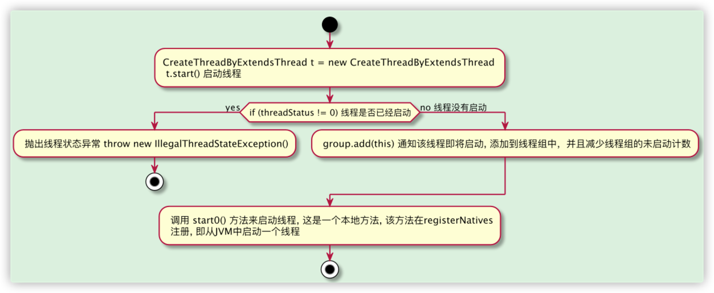
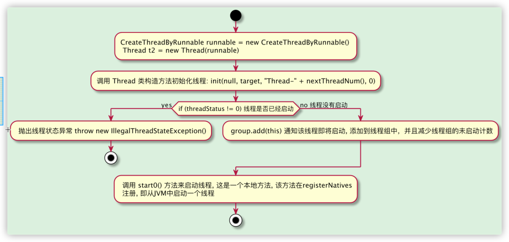

# Java 多线程
在线程这个概念提出之前，在操作系统中只有进程的概念。进程是操作系统结构的基础；是一次程序的执行。是系统进行资源分配和
调度的一个独立单位。

程序是指序列指令，这些指令可以让 CPU 按照人类指令完成相应的任务。在操作系统中启动一个 JVM 虚拟机就相当于创建了一个进程。

那什么是线程呢？线程是进程中独立运行的子任务，可以共享进程中相同的内存或文件资源。

# Java 线程的使用

## 继承 Thread 类

Java JDK 中包含了对多线程技术的支持。实现多线程编程主要有两种方式：

1. 继承 Thread 类；

2. 实现 Runnable 接口

### 继承 Thread 类

```java
public class CreateThreadByExtendsThread extends Thread{
    @Override
    public void run() {
        super.run();
        System.out.println("Create Thread by Extends Thread Begin to Run!");
    }
}
```


```java
public class ThreadTest {
    public static void main(String[] args) {
        CreateThreadByExtendsThread t = new CreateThreadByExtendsThread();
        t.setName("CreateThreadByExtendsThread"); // 指定线程执行名称
        t.start();  // 耗时较长
        System.out.println("当前线程" + Thread.currentThread().getName() + "执行结束\n" + "当前线程" + t.getName() + "执行结束"); //主线程耗时较短
    }
}
```

多次执行的结果，仔细观察就会发现，输出结果并不是随着调用顺序而输出的。而程序中执行 start方法比较耗时是因为该方法执行了多个步骤。步骤如下：

1. 通过 JVM 告诉操作系统创建 Thread；

2. 通过操作系统开辟内存并使用操作系统 SDK 中的 createThread() 函数创建 Thread 线程对象；

3. 操作系统对 Thread 对象进行调度，以确定执行时机；

4. Thread 在操作系统中被执行成功

以上4个步骤执行完成消耗的时间一定大于 main 方法中的输出时间。而且 main 方法执行 start() 方法时不需要等4个步骤都执行完毕，而是继续执行 start()
方法后面的代码，如果在主线程中直接调用 run 方法，输出顺序就是按照代码顺序输出，此时的 run 方法是由主线程调用的，所以才会按照代码顺序执行。

多线程随机输出的原因是 CPU 将时间片分给不同的线程，线程获得时间片后就开始执行任务，线程获得时间片是随机的，执行输出的顺序自然也是乱序的。

## 实现 Runnable 接口

如果想创建的线程类已经有了一个父类了，那么就不能再继承 Thread 类，此时就需要实现 Runnable 接口来解决这样的问题。

```java
public class CreateThreadByRunnable implements Runnable{

    @Override
    public void run() {
        System.out.println("Create Thread by implements Runnable Begin to Run!");
    }
}
```

```java
public class ThreadTest {
    public static void main(String[] args) {
        CreateThreadByRunnable runnable = new CreateThreadByRunnable();
        Thread t2 = new Thread(runnable);
        t2.setName("CreateThreadByRunnable");
        t2.start();  // 耗时较长
        System.out.println("当前线程" + Thread.currentThread().getName() + "执行结束\n" + "当前线程" + t2.getName() + "执行结束"); //主线程耗时较短
    }
}
```

### 使用 Runnable 接口实现多线程的优点

使用继承 Thread 类的方式实现多线程在程序设计上是有局限性的，这是由 Java 本身不支持多继承导致的。为了解决这样的局限性，因此采用实现 Runnable
接口来实现多线程的开发

在 Thread.java 类中也实现了 Runnable 接口。

```java
public
class Thread implements Runnable {
    /* Make sure registerNatives is the first thing <clinit> does. */
    private static native void registerNatives();

    static {
        registerNatives();
    }
    //...省略
}
```

测试代码如下：

```java
public class ThreadTest {
    public static void main(String[] args) {
        CreateThreadByExtendsThread t = new CreateThreadByExtendsThread();
        t.setName("CreateThreadByExtendsThread"); // 指定线程执行名称
        t.start();  // 耗时较长
        System.out.println("当前线程" + Thread.currentThread().getName() + "执行结束\n" + "当前线程" + t.getName() + "执行结束"); //主线程耗时较短
        
        // CreateThreadByExtendsThread 是 Thread 子类，
        // Thread 是 Runnable 子类，所以 CreateThreadByExtendsThread 相当于 Thread 的实现类
        // 所以构造函数可以传入一个 Thread 类，这样完全可以将 Thread 类对象中的 run 方法交由其他线程调用
        
        Thread t3 = new Thread(t);
        t3.setName("测试Thread可以传入Runnable接口");
        t3.start();
    }
}
```

# 实现 Runnable 接口与继承 Thread 类的内部流程

前面提到过 继承 Thread 和实现 Runnable 接口两种线程创建方式的执行过程是不一样的。稍微进一步看一下内部的调用流程：

## Thread执行过程

```java
CreateThreadByExtendsThread t = new CreateThreadByExtendsThread();
t.setName("CreateThreadByExtendsThread"); // 指定线程执行名称
t.start();  // 耗时较长
```
通过 t.start() 启动线程:

```java
   /**
     * Causes this thread to begin execution; the Java Virtual Machine
     * calls the <code>run</code> method of this thread.
     * <p>
     * The result is that two threads are running concurrently: the
     * current thread (which returns from the call to the
     * <code>start</code> method) and the other thread (which executes its
     * <code>run</code> method).
     * <p>
     * It is never legal to start a thread more than once.
     * In particular, a thread may not be restarted once it has completed
     * execution.
     *
     * @exception  IllegalThreadStateException  if the thread was already
     *               started.
     * @see        #run()
     * @see        #stop()
     */
    public synchronized void start() {
        /**
         * This method is not invoked for the main method thread or "system"
         * group threads created/set up by the VM. Any new functionality added
         * to this method in the future may have to also be added to the VM.
         *
         * A zero status value corresponds to state "NEW".
         */
        if (threadStatus != 0)
            throw new IllegalThreadStateException();

        /* Notify the group that this thread is about to be started
         * so that it can be added to the group's list of threads
         * and the group's unstarted count can be decremented. */
        group.add(this);

        boolean started = false;
        try {
            start0();
            started = true;
        } finally {
            try {
                if (!started) {
                    group.threadStartFailed(this);
                }
            } catch (Throwable ignore) {
                /* do nothing. If start0 threw a Throwable then
                  it will be passed up the call stack */
            }
        }
    }

    private native void start0(); //注意这里

    /**
     * If this thread was constructed using a separate
     * <code>Runnable</code> run object, then that
     * <code>Runnable</code> object's <code>run</code> method is called;
     * otherwise, this method does nothing and returns.
     * <p>
     * Subclasses of <code>Thread</code> should override this method.
     *
     * @see     #start()
     * @see     #stop()
     * @see     #Thread(ThreadGroup, Runnable, String)
     */
```
根据源码可以知道, 先将启动的线程添加到线程组中 group.add(this);, 线程启动是通过一个本地方法 start0() 来启动一个线程，start0() 
这个方法是在线程的静态块中注册的，代码如下: 

备注: 线程组(ThreadGroup)简单来说就是一个线程集合。线程组的出现是为了更方便地管理线程。线程组提供了很多管理线程的方法。
```java
/* Make sure registerNatives is the first thing <clinit> does. */
private static native void registerNatives();
static {
    registerNatives();
}
```
registerNatives 作用是注册一些本地方法提供给Thread类来使用，比如start0()、isAlive()、currentThread()、sleep()等方法。
而registerNatives的本地方法定义在文件 Thread.c 中。(ToDo: 暂时先到这，后续可以看看)
这是继承Thread的启动过程。


## 实现Runnable 接口

Runnable与继承Thread启动线程的区别在于，实现Runnable接口，在启动线程会先执行 Thread 构造类中的 init() 方法去初始化线程, Thread 源码如下:

```java
public Thread(Runnable target) {
    init(null, target, "Thread-" + nextThreadNum(), 0);
}
```

之后线程的启动与 Thread 相同。


# 实例变量共享造成的非线程安全问题

自定义线程类中的实例变量针对其他线程可以分为可共享和不共享两类。这在多线程交互时是很重要的技术点。

## 不共享的数据

该线程内所拥有资源对于其他线程不可见。


