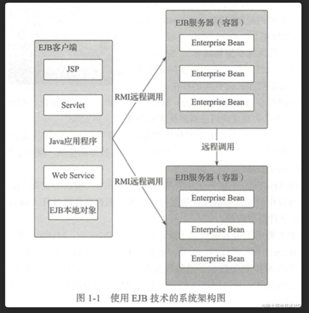
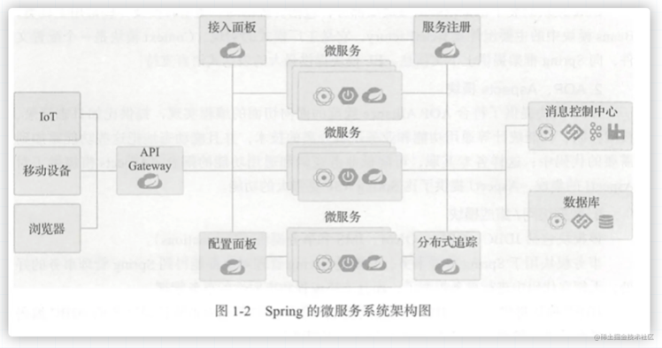
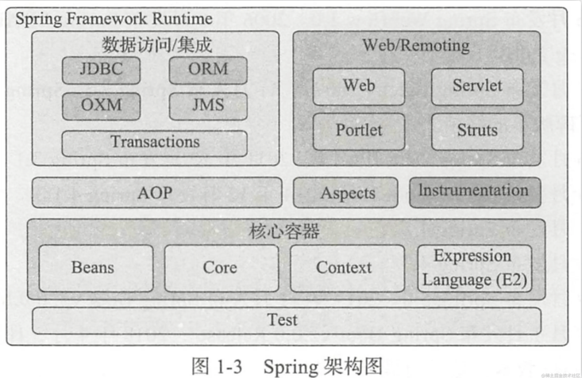
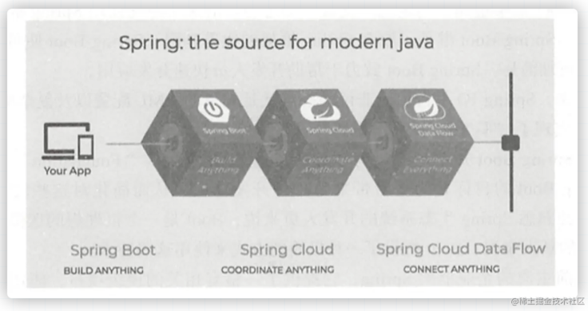
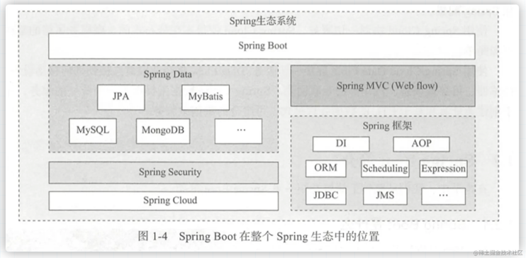
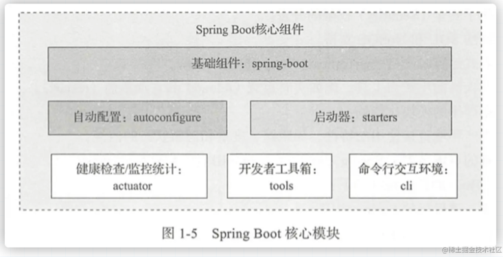

# Spring Boot简介

## Spring 了解

Spring 的出现主要是为了解决企业级应用程序开发的复杂性，它的 “零”侵入设计原则，颠覆了传统的编程模式。其核心的思想：IoC(Inversion of Control)控制反转，它的另一个名称叫做依赖注入(Dependency injection, DI)就是由spring容器来统一管理Bean之间的关系，而非传统编程中由程序员编码操控； 另一个核心就是AOP(面线切面编程)。

随着Spring的功能不断完善，版本迭代，它逐渐地也暴露出一些问题。比如多样化的配置，繁琐的使用过程，RD在程序开发中不仅要维护代码，还需要维护相关的配置文件。在大型的项目中，Spring就显得太笨重了，维护的成本也比较高。于是 [Spring Boot] 诞生了

## 框架的演变

由于 Spring 的笨重而产生了 Spring Boot，那么因为什么而产生了 Spring呢？

### EJB 到 Spring

简单了解一下 EJB(Enterprise Java Bean)，该框架最初的设计思想是为分布式应用服务的。而分布式是针对大型应用构造的跨平台的协作计算，使用 EJB 技术的系统整体架构如图所示：

EJB 的基础是 RMI(Remote Method Invocation，远程方法调用)，利用Java对象序列化的机制实现分布式计算。

RMI 将不同功能的模块放在不同的服务器上，然后通过各个服务器建立调用规则实现分布式的运算。通过 RMI 的通信(底层仍然是Socket)，与不同的功能模块进行交互，最终实现一个完整的业务功能。

但是 EJB 并不是实现 J2EE 的唯一途径，并且软件发展到今天，大多数应用并不需要这么重的解决方案，对于一些中小企业来说，EJB 太臃肿了。而对某些企业甚至可能用不到分布式。

所以 Spring 诞生了。它使用基本的 Java Bean 代替 EJB，并提供了更多的企业应用功能，使得已经存在的技术更加易用。

Spring 框架的核心功能简单概括来说：解藕依赖(DI)，系统模块化(AOP)。Spring 不重复造轮子，而是集成业内已有的优秀解决方案。比如集成 Struts, Hibernate, MyBatis 等组件，使用 AOP 框架提供诸如数据库声明式事务等服务。从而使得我们无需依赖 EJB 组件就可以将声明式事务管理集成到应用程序中。

当然，Spring 作为一个完整的 J2EE 框架，Spring 生态也给出了完整的分布式系统架构的解决方案，即 Spring Boot + Spring Cloud。这个解决方案包含了服务发现(Service Discovery)、、断路器( Circuit Breaker)、 0Auth2 (实现 sso、登录 token 的管理)、服务配置 (Configuration Server)、 消费者驱动契约( Consumer-Driven Contracts)、 API Gateway 等。Spring 的微服务系统架构如图所示：

### Spring 框架的核心模块

Spring 的框架如图所示：

#### 1.核心容器模块

核心容器提供 Spring 框架的基本功能， 包括 Core、Beans、Context、EL 模块。

Core 模块封装了框架依赖的最底层部分；Beans 模块中的主要组件是 BeanFactory，它是工厂模式的实现；Context 模块是一个配置文件，向 Spring 框架提供上下文信息。EL 则提供了强大的表达式支持语言。

#### 2.AOP、Aspects模块

AOP 模块提供了符合 AOP Alliance 规范的面相切面的编程实现，提供比如日志记录、权限控制、性能统计等通用功能和业务逻辑分离的技术。并且能动态地把这些功能添加到需要的代码中。

这样的实现降低了业务逻辑和通用功能的耦合。Aspects 框架提供了比 Spring ASP 更强大的功能。

#### 3.数据访问/集成模块

该模块包括 JDBC、ORM、OXM、JMS和事务模块(Transactions)。事务模块用于 Spring 管理事务，无需在代码中进行事务控制，并且支持编程和声明性的事务管理。

JDBC 模块提供了一个 JDBC 的样例模板，使用这种模板可以消除传统的冗余编码

ORM 模块提供了对 Object/XML的映射实现。

#### 4.Web/Remoting模块

Web/Remoting模块包含 Web、 Web-Servlet、 Web-Struts、 Web-Porlet模块。
Web 模块提供了基础的 Web 功能 。 例如多文件上传、集成 IoC 容器、远程过程访问
( RMI, Hessian、 Burlap)以及 Web Service 支持，并提供一个 RestTemplate类来提供方便的 Restful services访问

Web Servlet模块提供了一个 Spring MVC Web 框架实现 。
Web Struts 模块提供了与 Struts 无缝集成， Strutsl.x 和 Struts2.x 都支持

#### Test模块

Test 模块支持 Junit 和 TestNG测试框架，而且还提供了一些基于 Spring 的测试功能，比如在测试 Web 框架，模拟Http请求功能

## Spring 生态

当下 Spring 生态中， Spring Boot、Spring Cloud 和 Data Flow 起头并进带领使用 Spring 进行应用开发勇往直前。 如图所示：

Spring Boot 构建一切服务：使 RD 尽可能快地启动和运行，并极简化 Srping 配置

Spring Cloud 协调一切服务：使得实现分布式的、微服务风格的架构更加简单。

Spring Cloud Data Flow 连接一切服务：Data Flow 将企业服务连接到任何移动设备、传感器、可穿戴设备、汽车等互联网上。

## Spring Boot简述

前面提到过，Spring IO 平台饱受非议的就是大量的 XML 配置以及复杂的依赖管理。而 Spring Boot 实现了 “零 XML 配置”的极简开发体验。Spring Boot 在整个 Spring生态中的位置如下图：

需要注意理解的是：Spring Boot 并不是要成为 Spring IO 平台里面众多“Foundation” 基础 层项目的替代者。Spring Boot的宗旨是为平台带来另一种开发体验，从而达到简化对已技术的使用。所以对于熟悉 Spring 开发的 RD，Boot 能带来的是开发效率的提升，以及对业务的专注。对于新人来说，Boot 相对于 Spring 更易上手。

### Spring Boot 核心模块

Spring Boot 核心模块如图所示

1. Spring boot： Spring Boot 核心工程；
2. starters：Spring Boot 的启动服务工程。 Spring-Boot 中内置提供的starter列表可以在 Spring boot 项目源码中 spring-boot/spring-boot-starters 看到；
3. autoconfigure：是 Spring Boot 实现自动配置的核心工程。
4. actuator：提供 Spring Boot 应用的外围支撑性功能。比如：比如:应用状态监控管理、应用健康指示表、远程shell支持、 metrics支持等。
5. tools：提供了 Spring Boot开发者的常用工具集。诸如：spring-boot-gradle-plugin、 spring-boot-maven-plugin 就在这个模块里面
6. Spring Boot 命令行交互工具，可用于 Spring 进行快速原型搭建。

### COC 理念

Spring Boot 充分利用了 JavaConfig 的配置模式以及“[约定优于配置”( Convention Over Configuration, COC)的理念]，极大地简化了基于 SpringMVC 的 Web 应用和 REST 服务的开发。

