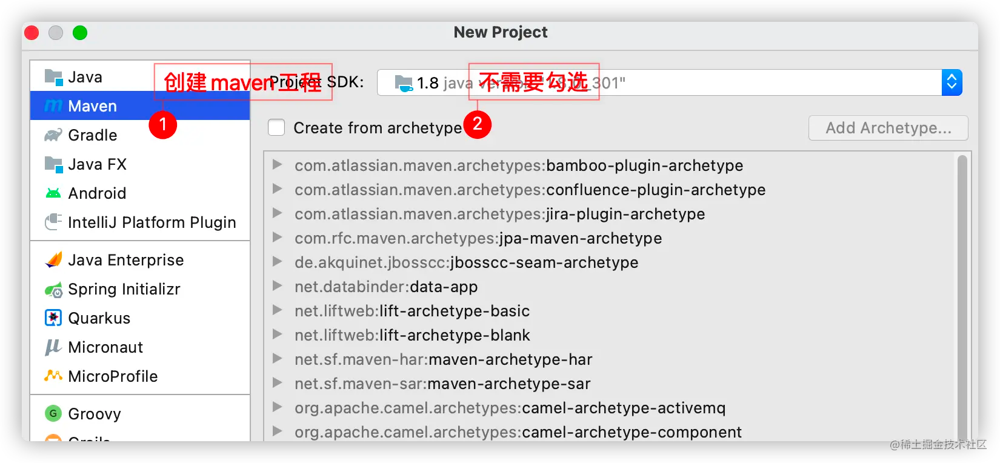
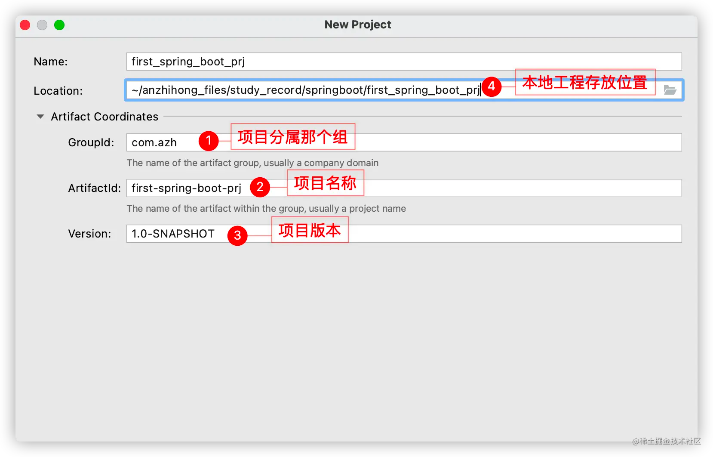
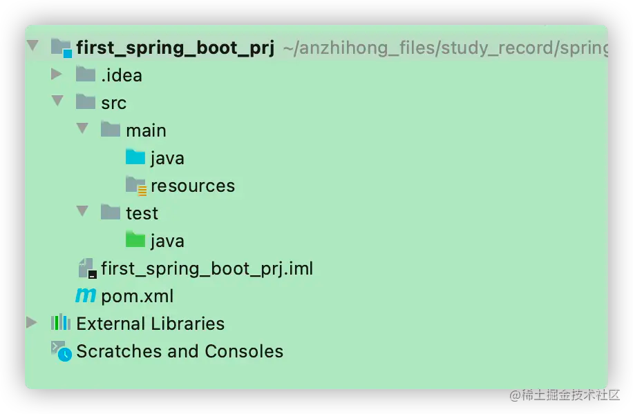
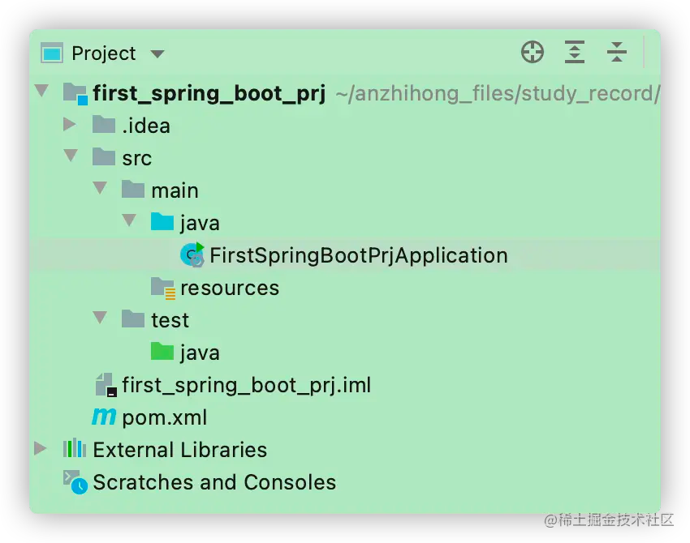
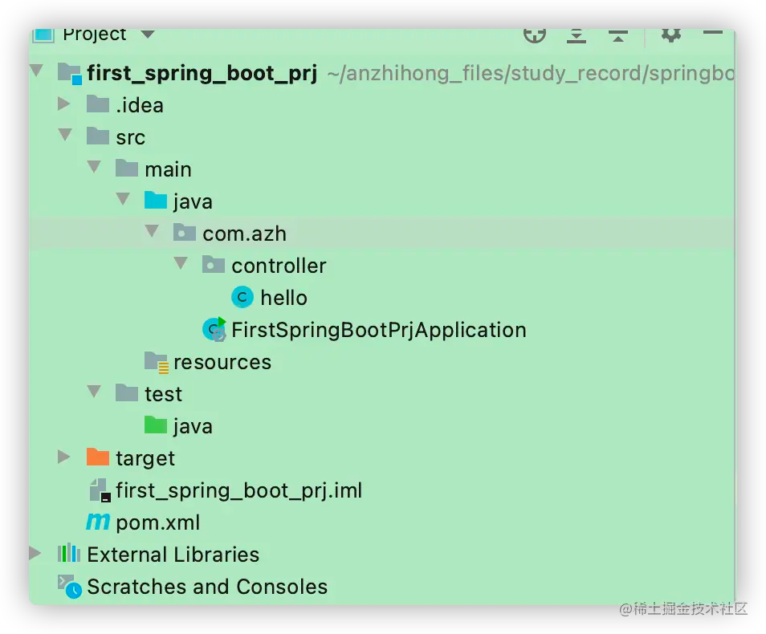

说明：首先是Java环境要都配置好，这里不再繁琐地进行说明。教程还是很多，可以百度一下，自行搭建一下。

# Spring 新建项目

Spring Boot 有多种创建方式，国内大多数选择的还是以 mave 搭建工程。所以后面搭建工程还是以 maven 为主。其他的方式后面了解学习一下。

## 创建工程

1.新建工程


2.选择创建maven工程



3.创建



Group：项目组织的标识符；

Artifact：项目标识符；

version：项目版本号；


不同的IDEA可能展示的界面不一样。不过比较重要的就是上述三个说明。


然后一路 next

最后创建好的工程如下



main.java：主要存放业务代码

resources：主要存放配置文件

test.java：主要存放单元测试的代码

根据目录总得来说可以分为4个部分：

1. Java类文件：主要存放 Java 类文件，即主业务的逻辑代码；

2. 资源文件：配置文件：存放 .yml 文件或者 .properties文件。其配置属于K-V形式的

3. 测试类文件：用于存放对 Java 类文件中逻辑代码测试的 Java代码文件；

4. pom文件：maven 项目构建的重要文件；

## 改造

将 Maven 工程改造为 Srping Boot 工程。

首先在 pom.xml 文件中添加 Spring Boot 依赖，构建 Spring Boot 工程。pom.xml 配置如下：

```xml
<?xml version="1.0" encoding="UTF-8"?>
<project xmlns="http://maven.apache.org/POM/4.0.0"
         xmlns:xsi="http://www.w3.org/2001/XMLSchema-instance"
         xsi:schemaLocation="http://maven.apache.org/POM/4.0.0 http://maven.apache.org/xsd/maven-4.0.0.xsd">
    <modelVersion>4.0.0</modelVersion>

    <!--项目分组、项目名称、版本号-->
    <groupId>com.azh</groupId>
    <artifactId>first-spring-boot-prj</artifactId>
    <version>1.0.0-SNAPSHOT</version>
    <packaging>jar</packaging>

    <name>first-spring-boot-prj</name>
    <description>第一个 Spring Boot 工程</description>

    <!-- 父项目的坐标，坐标包括group ID，artifact ID和version -->
    <!-- 如果项目中没有规定某个元素的值，那么父项目中的对应值即为项目的默认值 -->
    <parent>
        <!--被继承的父项目的构件标识符 -->
        <artifactId>spring-boot-starter-parent</artifactId>
        <!--被继承的父项目的全球唯一标识符 -->
        <groupId>org.springframework.boot</groupId>
        <!--被继承的父项目的版本 -->
        <version>2.3.9.RELEASE</version>
        <!-- 父项目的pom.xml文件的相对路径,默认值是../pom.xml。 -->
        <!-- 寻找父项目的pom：构建当前项目的地方->relativePath指定的位置->本地仓库->远程仓库 -->
        <relativePath/><!-- lookup parent from repository -->
    </parent>

    <!--工程属性的全局配置-->
    <properties>
        <!-- 源文件编码形式 -->
        <project.build.sourceEncoding>UTF-8</project.build.sourceEncoding>
        <!-- 所有插件输出编码形式 -->
        <project.reporting.outputEncoding>UTF-8</project.reporting.outputEncoding>
        <!-- Java 版本 -->
        <java.version>1.8</java.version>
    </properties>

    <!-- 定义的依赖清单，有所依赖包都需要写在这个标签里面 -->
    <dependencies>
        <!-- spring boot 启动依赖，由于指定了spring parent版本，所以这里可以不指定 -->
        <dependency>
            <!--依赖项的组织名-->
            <groupId>org.springframework.boot</groupId>
            <!--依赖项的子项目名-->
            <artifactId>spring-boot-starter</artifactId>
            <!--依赖项的版本-->
            <!--<version>${引用properties中定义的全局配置变量}</version>-->
        </dependency>

        <dependency>
            <groupId>org.springframework.boot</groupId>
            <artifactId>spring-boot-starter-test</artifactId>
            <!-- 依赖项的适用范围 -->
            <scope>test</scope>
            <!-- 可选依赖 ，对外隐藏当前所依赖的资源，是不透明的；如果别人依赖了本项目，
            被配置的不会在别人的项目中依赖到 -->
            <!-- <optional>true</optional> -->
            <!-- 排除依赖，主动断开依赖的资源，排除项目中的依赖冲突时使用，
            不依赖该项目，被排除的资源不需要指定版本-->
<!--            <exclusions>
                <exclusion>
                    <groupId></groupId>
                    <artifactId></artifactId>
                </exclusion>
            </exclusions>-->
        </dependency>

        <!--一般我们开发是Web项目，所以还需要引入 Web 的 Starter-->
        <dependency>
            <groupId>org.springframework.boot</groupId>
            <artifactId>spring-boot-starter-web</artifactId>
        </dependency>
    </dependencies>
</project>
```
### 创建入口类 xxxApp

创建位置位于上述的 Java 目录中



代码如下：

```java
@EnableAutoConfiguration
public class FirstSpringBootPrjApplication {
    public static void main(String[] args) {
        SpringApplication.run(FirstSpringBootPrjApplication.class, args);
    }
}
```

解释：

1. @EnableAutoConfiguration 注解表示开启自动化配置。由于项目中添加了 spring-boot-starter-web 依赖，因此在开启了自动化配置之后，会自动进行 Spring 和 Spring MVC 的配置

2. 在 Java 项目的 main 方法中，通过 SpringApplication 中的 run 方法启动项目。 第一个参数传入 App.class，告诉 Spring 哪个是主要组件。第二个参数是运行时输入的其他参数。

### 接下来创建一个 Spring MVC 的控制器

创建一个 controller 文件，存放通过 http/https 访问的接口文件。创建如下：

```java
@RestController
public class hello {
    @GetMapping("/hello")
    public String herllo(){
        return "hello spring boot !";
    }
}
```

解释：

在控制器中提供一个 “/hello” 接口，此时需要配置包扫描才能将 hello 注册到 Spring MVC 容器中，所以需要在 FirstSpringBootPrjApplication 上添加一个注解 @ComponentScan 进行包扫描。

也可以直接使用组合注解 @Spring BootApplication 来代替 @EnableAutoConfiguration 和 @ComponentScan。

## 项目启动

有三种启动方式：

1. 使用 maven命令启动：mvn spring-boot run

2. 直接运行 mian 方法

启动报错，打印信息如下：

```tex
....

** WARNING ** : Your ApplicationContext is unlikely to start due to a @ComponentScan of the default package.
...

Caused by: java.lang.IllegalStateException: Could not evaluate condition on org.springframework.boot.autoconfigure.jdbc.DataSourceAutoConfiguration$EmbeddedDatabaseConfiguration due to org/springframework/jdbc/datasource/embedded/EmbeddedDatabaseType not found. Make sure your own configuration does not rely on that class. This can also happen if you are @ComponentScanning a springframework package (e.g. if you put a @ComponentScan in the default package by mistake)
```
出现这个问题是因为我搭建的目录结构导致，启动类直接创建在了 main/java 文件下了。@ComponentScan 扫描范围是当前包以及以下。而启动类 FirstSpringBootPrjApplication 不属于任何一个包，所以启动类没有包，导致启动提示可能因为 @ComponentScan 注解导致启动失败，其次 main/java 并不是一个包，它是一个资源文件夹。

重新调整一下目录结构，并制定 @ComponentScan 扫描的路径

目录调整如下：



代码如下：

```java
@ComponentScan(basePackages = {"com.azh.*"})
@EnableAutoConfiguration
public class FirstSpringBootPrjApplication {
    public static void main(String[] args) {
        SpringApplication.run(FirstSpringBootPrjApplication.class, args);
    }
}
```

启动信息如下：

```tex
...
2021-12-19 17:04:03.430  INFO 68842 --- [           main] o.s.b.w.embedded.tomcat.TomcatWebServer  : Tomcat started on port(s): 8080 (http) with context path ''
2021-12-19 17:04:03.437  INFO 68842 --- [           main] com.azh.FirstSpringBootPrjApplication    : Started FirstSpringBootPrjApplication in 0.981 seconds (JVM running for 1.329)
...
```
看到这样的信息表示启动成功。[JVM running for 1.329]

启动成功后，在浏览器访问：http://localhost:8080/hello
界面显示：hello spring boot !

至此，一个 spring boot 项目创建成功。还有其他非常便捷的创建方法，这里就不做赘述了。基本是一键创建的过程。

3. 打包启动：Spring Boot 也可以直接打成 jar 包运行。 在生产环境中，也可以通过这样的方式来运行一个 Spring Boot 应用。 事实上，也是这样做的。

打包需要添加插件到 pom.xml 中，添加如下：

```xml
<!-- 构建项目所需要的信息 -->
<build>
    <!-- 插件管理 -->
    <plugins>
        <plugin>
            <groupId>org.springframework.boot</groupId>
            <artifactId>spring-boot-maven-plugin</artifactId>
            <version>2.3.9.RELEASE</version>
        </plugin>
    </plugins>
</build>
```

具体的打包细节后面介绍，开始只介绍一下启动。

使用 maven 命令打包：mvn package。在 target 目录下会生成一个 jar 包。然后使用 java -jar 命令执行 jar 包即可。

# 小结

讲这个复杂的是因为可以更好地方便自己了解创建过程，以及 pom.xml 的一些相关知识。查了一下 pom.xml 的相关知识：参考[ pom 文件详解](https://blog.csdn.net/weixin_38569499/article/details/91456988?spm=1001.2101.3001.6650.5&utm_medium=distribute.pc_relevant.none-task-blog-2%7Edefault%7EBlogCommendFromBaidu%7Edefault-5.opensearchhbase&depth_1-utm_source=distribute.pc_relevant.none-task-blog-2%7Edefault%7EBlogCommendFromBaidu%7Edefault-5.opensearchhbase)

截图如下：因为 CSDN 老是有图片丢失的情况发生


