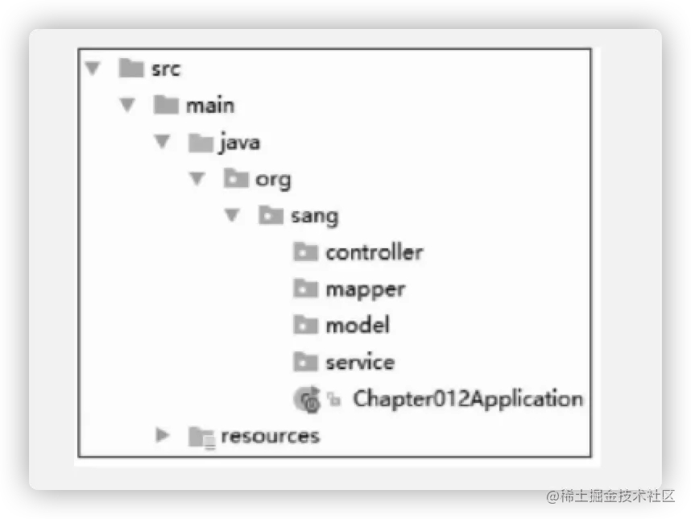
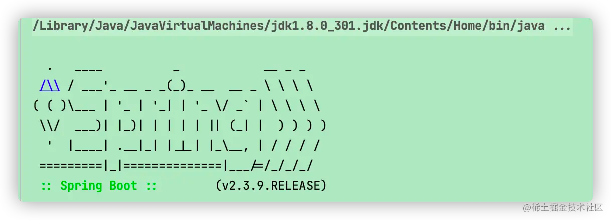
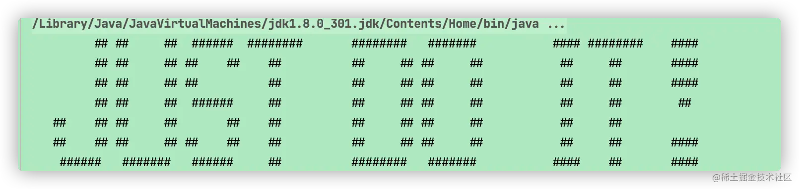
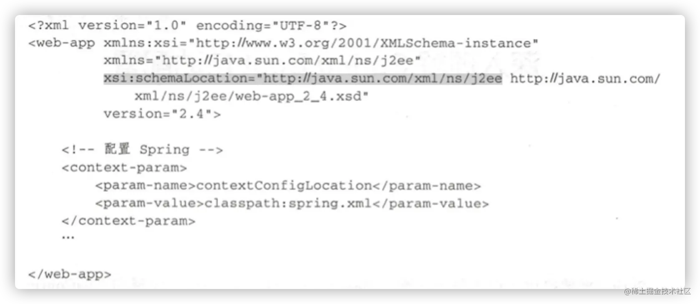

# Spring Boot 基本配置

上一篇大致介绍了 Spring Boot 的搭建过程，本章进一步介绍 Spring Boot 的基本配置

# 不使用 Spring-boot-starter-parent

spring-boot-starter-parent 主要提供了如下默认配置：

1.Java 版本默认使用 1.8；

2.编码格式默认使用 UTF-8；

3.提供 Dependency Management 进行项目依赖的版本管理；

4.默认的资源过滤与插件配置；

Spring-boot-starter-parent 虽然方便，但是在实际的工作当中，一般都使用公司自己的parent，这个时候如果还想进行项目依赖版本的统一管理，就需要使用 dependencyManagement 来实现了。添加如下代码到 pom.xm 文件中：

```xml
<dependencyManagement> <!-- dependencyManagemen_start -->
    <dependencies>
        <dependency>
            <groupId>org.springframework.boot</groupId>
            <artifactId>spring-boot-dependencies</artifactId>
            <version>2.3.9.RELEASE</version>
        </dependency>
        
        ...
    </dependencies>
</dependencyManagement>
```

此时就不需要继承 spring-boot-starter-parent 了，但是 Java 版本、编码格式等都需要开发者手动配置。 Java 版本的配置很简单，在 pom.xml 中添加一个 plugin 即可：

```xml
<plugin>
    <groupId>org.apache.maven.plugins</groupId>
    <artifactId>maven-compiler-plugin</artifactId>
    <version>3.1</version>
    <configuration>
        <source>1.8</source>
        <target>1.8</target>
    </configuration>
</plugin>
```

至于编码格式，则是上一篇介绍的 `<properties></properties> ` 配置的属性，但是记得要把之前制定的 java 版本注释掉。

## 了解 @Spring BootApplication

@Spring BootApplication 注解是加在项目的启动类上的，它是一个组合注解。定义如下：

```java
@SpringBootConfiguration
@EnableAutoConfiguration
@ComponentScan(
    excludeFilters = {@Filter(
    type = FilterType.CUSTOM,
    classes = {TypeExcludeFilter.class}
), @Filter(
    type = FilterType.CUSTOM,
    classes = {AutoConfigurationExcludeFilter.class}
)}
```

第一个 @SpringBootConfiguration 定义如下：

```java
@Configuration
public @interface SpringBootConfiguration {
    @AliasFor(
        annotation = Configuration.class
    )
    boolean proxyBeanMethods() default true;
}
```

本质上这就是一个 @Configuration，所以 @SpringBootConfiguration 的功能就是表明这是一个配置类，开发者可以在这个配置类中配置 Bean。其功能类似于 Spring 中的 applicationContext.xml 文件的角色。

而 @Configuration 注解使用的又是 @Component 注解：

```java
@Target({ElementType.TYPE})
@Retention(RetentionPolicy.RUNTIME)
@Documented
@Component
public @interface Configuration {
    @AliasFor(
        annotation = Component.class
    )
    String value() default "";

    boolean proxyBeanMethods() default true;
}
```
@Component 注解的功能是把普通的 POJO 实例化到 Spring 容器中，相当于配置文件的 `<bean id="" class="">`；而在类上添加注解 @Configuration，表名这个类代表一个 Spring 配置文件，与原来 XML 配置是等效的。相比较于 XML 的配置， 注解的代码更具有可读性，编写也更加方便。


第二个注解 @EnableAutoConfiguration 表示开启自动化配置，它可以启用 Spring 应用程序上下文的自动配置，Spring Boot 会自动推导和配置你可能需要的 Bean。 Spring Boot 中的自动化配置是非入侵式的， 在任意时刻，RD 都可以使用自定义配置代替自动化配置中的某一个配置

第三个注解 @ComponentScan 完成包的扫描， 是 Spring 中的功能。由于 @ComponentScan 注解默认扫描的类都位于当前类所在包的下面，所以建议在实际项目的开发中，都把项目启动类放在根包中。如图所示



虽然项目启动类也包含 @Configuration 注解， 但是RD可以创建一个新的类专门用来配置我们需要的 Bean，这样便于整个项目配置的管理，比如配置自动注入数据源的配置类（后面介绍）。 这个类只需要加上 @Configuration 注解即可。 代码如下：

```java
@Configuration
public class MyConfig {

}
```
在项目启动时，@ComponentScan 就会扫描到 @Configuration 注解的类。

# 定制 banner

Spring Boot 启动时会打印一个 banner，如图所示：



这个 banner 是可以定制的，在 resources 目录下创建一个 banner.txt 文件，在这个文件中写入的文本将在项目启动时打印出来。如果想将 TXT 文本设置成艺术字体，有以下几个在线网站可供参考：

http://www.network-science.de/ascii/

应该还有其他的更好的网站，可以自行百度一下。这个感觉不太 “花哨”
将网站生成的字体拷贝到 banner.txt 文件中，重启项目看结果：



如果想关闭 Banner，可以在 Spring Boot 中设置关闭 banner。代码如下所示

注意需要注释掉默认的启动类

```java
SpringApplicationBuilder banner = new SpringApplicationBuilder(FirstSpringBootPrjApplication.class);
banner.bannerMode(Banner.Mode.OFF).run(args);
```

# 进一步了解 Spring Boot 配置

## 传统的 SSM 开发过程

SSM(Spring + SpringMVC + Mybatis) 曾经是主流的企业级架构方案：标准的 MVC 分层架构，将整个系统分为模板式图(View)层、控制器(Controller)层、业务逻辑(Service)层、数据访问(Dao)层。

使用 SpringMVC 负责请求的转发和视图的管理，使用 Spring 核心容器实现业务对象的协作和生命周期的管理，Mybatis 作为数据库 ORM 层的对象持久化引擎。这种分层的架构设计在 Spring Boot中也仍然在使用。

在 Spring 的搭建过程中，我们需要小心的配置 pom.xml 文件，因为需要 RD 杜绝各个依赖的 jar 包不兼容的情况，对于动辄上百行的 pom.xml 文件，这样的做法对于 RD 是一个很大的 “挑战”；除此之外，还需要对配置 Spring 上下文的 spring.xml 文件；在这个文件中配置了 Spring 的 BeanFactory 工厂进行 Bean 生产、依赖关系注入(装配)以及 Bean 实例的分发 “图纸总纲”，RD 必须非常了解这份 “图纸” 从而才能准确地表达自己的 “生产意图”。当一个程序及其庞大时，可想而知，RD 的大多数时间不是花费在了对业务的逻辑处理上，而是配置文件。

相信经历过 Spring 开发的大佬们，估计配置这一块是最 “那啥” 的了。刚开始学 Spring 开发的时候，感觉配置都给我整 懵 xxx 了。😂

简单描述一下配置，也更是为了体现出 Spring Boot 的极简开发。

Spring 配置文件是一个或者多个标准的 XML 配置文档。 如果在 web.xml 中没有显示指定contextConfigLocation，Spring 将会默认使用 XmlWebApplicationContext 的默认配置 /WEB-INF/app-licationContext.xml。applicationContext.xml 是 Spring 默认的配置文件，当容器启动时找不到对应的文档，就会默认加载这个默认的配置文件。

指定使用自定义名称的 spring.xml 文件，就需要在 web.xml 中通过配置 contextConfigLocation 参数来指定 Spring 的配置文件。如下图所示：



完整的 Spring 配置文件 spring.xml 内容是很多的。这仅仅是搭建 Spring 项目，如果是 web 项目开发，还需要配置 spring-mvc.xml 这个 XML。该文件的上下文配置主要是：org.springframework.web.servlet DispatcherServlet

DispatcherServlet 从类名就可以知道这是一个分发器，是 MVC 的集中访问点，负责任务的分发。DispatcherServlet 与 Spring IOC 无缝集成，具备 Spring 所有的好处。在 spring-mvc.xml 配置文件中我们需要配置默认的注解映射、自动扫描包的路径、视图模版引擎等等一系列配置，完整的 spring-mvc.xml 配置文件内容还是比较多的，这里就不举个🌰了。

主要看一下关于 DispatcherServlet 的配置，在应用程序目录中的 classpath:spring-mvc.xml 配置 MVC 的配置文件位置。配置实例如下：

```xml
<!-- 配置 springmvc -->
<servlet>
    <servlet-name>springMVC</servlet-name>
    <servlet-class>org.springframework.web.servlet.DispatcherServlet</servlet-class>
    <init-param>
        <param-name>contextConfigLocation</param-name>
        <param-value>classpath:spring-mvc.xml</param-value>
    </init-param>
    <load-on-startup>1</load-on-startup>
</servlet>
<servlet-mapping>
    <servlet-name>springMVC</servlet-name> 
    <url-pattern>/</url-pattern>
</servlet-mapping>
```
这样 Spring Web MVC 框架将加载 “classpath:spring-mvc.xml” 来进行上下文的初始化，而不是按照默认的路径来进行初始化。

web.xml 是用来初始化整个项目的配置信息，又称为部署描述文件。部署描述文件必须以 XML 头开始，这个头 声明了可以使用的 XML 版本并给出文件的字符编码。DOCYTPE 声明必须立即出现在此头之后，这个声明告诉服务器适用的 servlet 规范的版本，并指定管理此文件其余部分内容语法的DTD(Document Type Definition，文档类型定义）.

web.xml 的加载顺序是：
```
<context-param>一-><listener> -→ <filter>一-> <servlet>
```

其中如果 web.xml 中出现了相同的元素，则按照在配置文件中出现的先后顺序来加载。当我们使用 Spring 的注解，如：@Service、@Controler等，需要告诉 Spring 扫描的路径，否则无法自动注入这些 bean。这个配置上面也提到过，在 spring.xml 中配置。如：

```xml
<!-- 扫描 service、 dao组件 -->
<context:component-scan base-package="com.easy.Spring Boot"/>
```

而这个配置等同于下面的 Spring Boot 注解配置

```java
@ComponentScan(basePackage=”com.easy.Spring Boot”)
```
这个例子也说明 Spring Boot 就是使用大量的基于注解的配置，从而去除 XML 配置

在通常的 Java Web 项目开发中，还需要配置 Tomcat 服务器，然后在 IDE 中配置集成。这个过程也是比较费时的。而 Spring Boot 内嵌了 Tomcat，根本不需要配置 Tomcat。

到这里大致介绍了在 Spring Boot 之前 基于 Spring 的开发过程，也验证了确实有大量的配置工作，在一个庞大的项目中，如果不是 XML 及其熟练，开发的难度还是很大的，繁琐的 XML 配置可能就把人给整晕了😭😭😭。
