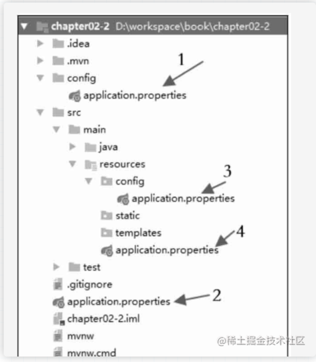

继续来学习一下 Spring Boot 的配置。

# Spring Boot 的日志依赖

日志系统多种多样，Java中有默认的 java.util 提供的日志支持，而且有很多日志框架供我们选择。如：log4j、log4j2、commons-logging等日志框架。可以通过如下配置在 Maven中添加 spring-boot-starter-logging 依赖模块。

```xml
<dependency>
    <groupId>org.springframework.boot</groupId>
    <artifactId>spring-boot-starter-logging</artifactId>
</dependency>
```
如果不对 Spring Boot 提供的日志做调整，那么 Spring Boot将自动使用 logback 作为项目的日志框架。即“开箱即用”， 不需要做任何多余的配置。

如果需要对 Spring Boot 默认提供的日志做出调整，则要按照 logback 约定，定义自己定制的 logback.xml 日志文件。该文件一般放在项目中的 src/main/resources 目录下。然后在 工程的配置文件中指定。如 application.properties

```properties
logging.config = logback.xml
```

如果要使用 log4j2，则只需要添加相应的依赖即可

```xml
<dependency>
    <groupId>org.springframework.boot</groupId>
    <artifactId>spring-boot-starter-log4j2</artifactId>
</dependency>
```
具体的 logback.xml 配置如下：

```xml
<?xml version="1.0" encoding="UTF-8"?>

<configuration debug="false" scan="false">
    <conversionRule conversionWord="wEx" converterClass="org.springframework.boot.logging.logback.ExtendedWhitespaceThrowableProxyConverter" />
    <conversionRule conversionWord="wex" converterClass="org.springframework.boot.logging.logback.WhitespaceThrowableProxyConverter" />
    <property name="log.path" value="/data/logs/xxx-server" />
    <property name="application.name" value="xxxx-server" />
    <property name="FILE_LOG_PATTERN" value="${FILE_LOG_PATTERN:-%d{yyyy-MM-dd HH:mm:ss.SSS} ${LOG_LEVEL_PATTERN:-%5p} ${PID:- } --- [%t] %-40.40logger{39} : %m%n${LOG_EXCEPTION_CONVERSION_WORD:-%wEx}}"/>

    <appender name="console" class="ch.qos.logback.core.ConsoleAppender">
        <encoder>
            <pattern>${FILE_LOG_PATTERN}</pattern>
        </encoder>
    </appender>
        <!-- Log file debug output -->
    <appender name="logelk" class="ch.qos.logback.core.rolling.RollingFileAppender">
        <!-- 配置滚动的策略 -->
        <rollingPolicy class="ch.qos.logback.core.rolling.TimeBasedRollingPolicy">
            <!-- 日志名称的格式 -->
            <fileNamePattern>${log.path}/${application.name}.%d{yyyy-MM-dd}.log</fileNamePattern>
            <!-- 保存的最长时间：天数 -->
            <MaxHistory>30</MaxHistory>
        </rollingPolicy>
        <encoder class="ch.qos.logback.classic.encoder.PatternLayoutEncoder">
            <pattern>${FILE_LOG_PATTERN}</pattern>
        </encoder>
        <filter class="ch.qos.logback.classic.filter.LevelFilter">
            <onMatch>ACCEPT</onMatch>
            <onMismatch>DENY</onMismatch>
        </filter>
    </appender>
    
    <root level="info">
        <appender-ref ref="console" />
        <appender-ref ref="logelk" />
    </root>
</configuration>
```

# Spring Boot 的Properties配置

尽管 Spring Boot 极大的简化了配置，但是有些配置仍然不可避免地需要 RD 自己手动配置。而承载这些自定义配置的文件就是 resources目录下的 application.properties 文件里(也可以使用 YAML 配置来代替)

该文件可以出现在如下 4 个文件位置:

1. 项目根目录下的 config 文件夹中

2. 项目根目录下

3. classpath 下的 config 文件夹中

4. classpath下

如果这四个位置中都有 application.properties 文件， 那么加载的优先级从 1 到 4 依次降低，如图所示




